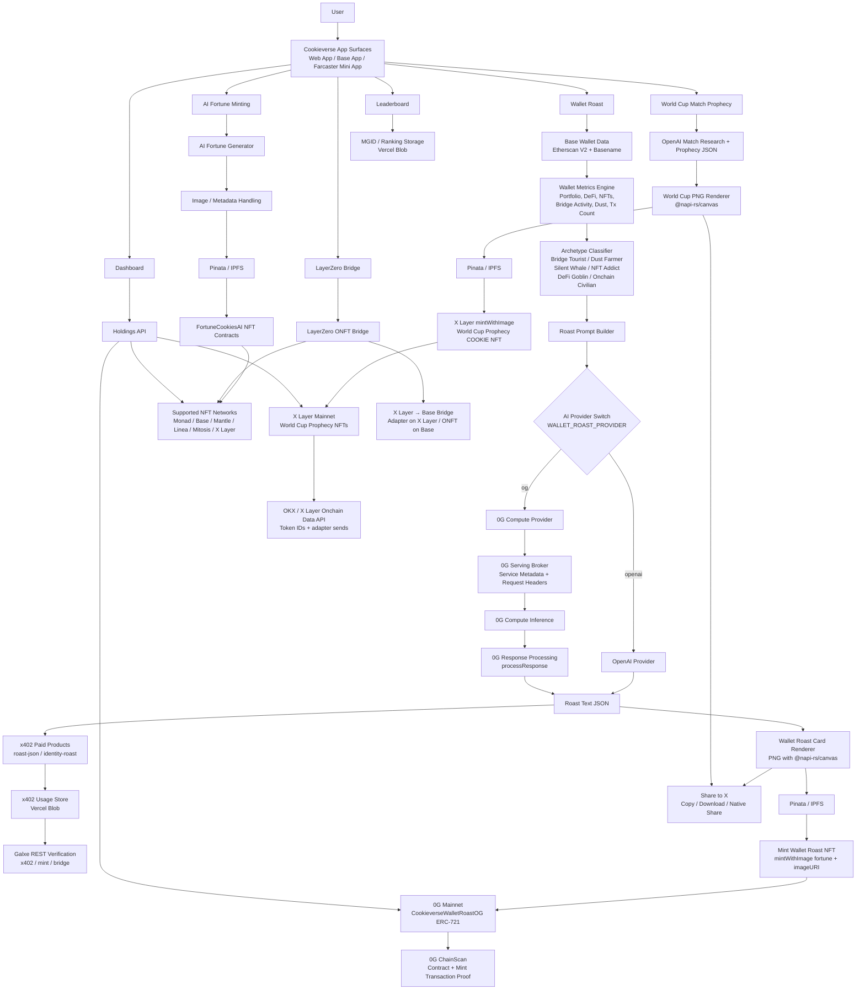

# 🍪 Cookieverse

<p align="center">
  
</p>

<p align="center">
  <b>Cookieverse turns wallets into AI-powered social identities: fortune NFTs, paid x402 Wallet Roast products, World Cup prophecy NFTs on X Layer, cross-chain COOKIEs, dashboards, Galxe tasks, and leaderboards.</b>
</p>

<p align="center">
  
  
  
  
</p>

<p align="center">
  
  
  
  
  
  
</p>

---

## Overview

Cookieverse is a consumer crypto app that makes onchain activity fun, visual, collectible, and shareable.

Users can generate AI fortunes, mint COOKIE NFTs, roast wallets, render beautiful share cards, unlock paid Wallet Roast products through x402, create World Cup match prophecy NFTs on X Layer, bridge COOKIE NFTs across supported chains, complete Galxe-verifiable tasks, track activity in a dashboard, and compete on leaderboards.

Cookieverse is built as a multi-surface product:

- Main web app
- Base App compact experience
- Farcaster Mini App routes
- Cross-chain NFT bridge
- Wallet Roast identity layer
- World Cup Match Prophecy layer
- NFT minting and social sharing flows

The product goal is simple:

> Make wallet activity and cultural moments feel like social identity, not just block explorer history.

---

## Feature Snapshot

| Area | What it does |
| --- | --- |
| 🍪 AI Fortunes | Generate short AI fortune text and mint it as a COOKIE NFT. |
| 🖼️ AI Image Mints | Generate or upload image-based COOKIE NFTs with IPFS metadata. |
| ⚽ World Cup Prophecy | AI researches historical match context, creates a World Cup-style prophecy, renders a collectible PNG card, and mints it as a COOKIE NFT. |
| 🖼️ Prophecy Card Renderer | Uses `@napi-rs/canvas` and World Cup templates to render premium match prophecy cards server-side. |
| 🟣 X Layer Mainnet | Supports X Layer wallet connection, World Cup prophecy minting, NFT holdings, dashboard, leaderboard and bridge activity. |
| 🌉 X Layer → Base Bridge | Bridges COOKIE NFTs from X Layer to Base through LayerZero adapter / ONFT contracts. |
| 🔥 Wallet Roast | Analyze a Base wallet and turn it into a funny AI roast card. |
| 🧠 Wallet Archetypes | Classify wallets as Bridge Tourist, Dust Farmer, Silent Whale, NFT Addict, DeFi Goblin, or Onchain Civilian. |
| 🤖 AI Providers | Uses 0G Compute by default and can route Wallet Roast generation through OpenAI. |
| ⛓️ 0G Mainnet | Supports Wallet Roast NFT minting on 0G Mainnet for product expansion and hackathon proof. |
| 🌉 LayerZero Bridge | Bridges COOKIE NFTs across supported networks, including the focused X Layer → Base route. |
| 🔵 Base App | Mobile-first compact Cookieverse shell for Base App users. |
| 🟣 Farcaster Mini App | Dedicated `/mini` routes for Farcaster Mini App contexts. |
| 🏆 Leaderboard | Ranks users by Cookieverse activity. |
| 📊 Dashboard | Tracks holdings, image mints, quests, boosts, and activity. |
| 🐦 X Sharing | Lets users share generated cards, mints, and roast content on X. |
| 💳 x402 Paid Roasts | Supports paid Wallet Roast products through Coinbase x402 and Bankr x402. |
| 🏦 Coinbase x402 | Cookieverse acts as the x402 seller for paid roast endpoints protected by `src/proxy.ts`. |
| 🤖 Bankr x402 | Bankr Cloud acts as the x402 seller and calls Cookieverse paid backend after payment. |
| ✅ Galxe REST Tasks | Verifies x402 usage, COOKIE minting, and bridge activity for Galxe campaigns. |

---

## App Surfaces

### Main Web App

Routes:

```txt
/
 /bridge
 /dashboard
 /leaderboard
 /mgid-leaderboard
```

The main web app includes AI fortune minting, World Cup Match Prophecy, Wallet Roast, NFT minting, bridge flows, dashboards, and leaderboards.

### Base App

Routes:

```txt
/app
/app/bridge
/app/dashboard
/app/leaderboard
```

The Base App surface is a compact mobile/tablet experience. It uses a dedicated shell and layout constraints to make Cookieverse usable inside Base App-style environments. It also includes a compact World Cup header/banner and the same World Cup Prophecy flow.

### Farcaster Mini App

Routes:

```txt
/mini
/mini/bridge
/mini/dashboard
/mini/leaderboard
/mini/smartaccount
```

The Farcaster Mini App surface uses dedicated mini routes, metadata, compact navigation, and Mini App providers.

---

## System Architecture



---

## Core Product Flows

### 1. AI Fortune Minting

User flow:

```txt
User enters topic / vibe / optional name
→ Cookieverse generates a short AI fortune
→ User mints the fortune through FortuneCookiesAI
→ NFT appears in holdings and dashboard
```

Important app areas:

```txt
src/app/page.tsx
src/app/api/fortune/route.ts
src/app/api/images/route.ts
src/app/api/pinata/route.ts
src/abi/FortuneCookiesAI.json
```

---

### 2. World Cup Match Prophecy on X Layer

World Cup Match Prophecy is the main X Layer Build X Hackathon-facing feature.

It turns a simple match input into a collectible AI-powered NFT card.

User flow:

```txt
Open Cookieverse
→ Connect wallet
→ Switch to X Layer Mainnet
→ Enter Team 1
→ Enter Team 2
→ Select match date
→ Click Create Match Prophecy
→ AI generates match prophecy JSON
→ Server renders World Cup prophecy card PNG
→ User can download, copy, share on X, or mint
→ Mint Prophecy uploads image to IPFS and calls mintWithImage()
```

The user does not manually write match context or choose criteria. The AI agent creates the context and criteria itself.

Generated prophecy cards include:

```txt
Team 1
Team 2
Match date
Pick
Score
Confidence
Prophecy text
Short reasoning line
Criteria scores
```

Prophecy criteria:

```txt
Form
Attack
Defense
Momentum
Fans
Confidence
```

Important implementation areas:

```txt
src/app/page.tsx
src/app/api/xcup/prophecy/route.ts
src/app/api/xcup/render/route.ts
src/lib/xcup/types.ts
src/lib/xcup/renderProphecyCard.ts

public/xcup/world-cup-prophecy-template.png
public/xcup/world-cup-header-desktop.png
public/xcup/world-cup-header-mobile.png
```

The rendered card uses `@napi-rs/canvas`, local template assets, local fonts, and tunable layout boxes, following the same server-side image-rendering architecture as Wallet Roast.

#### World Cup Prophecy AI Flow

Cookieverse uses OpenAI for World Cup prophecy generation.

Endpoint:

```txt
POST /api/xcup/prophecy
```

Input:

```json
{
  "homeTeam": "Argentina",
  "awayTeam": "Spain",
  "matchDate": "2026-07-20"
}
```

Output shape:

```json
{
  "title": "World Cup Match Prophecy",
  "homeTeam": "Argentina",
  "awayTeam": "Spain",
  "matchDate": "2026-07-20",
  "location": "",
  "pick": "Argentina",
  "scoreline": "2-1",
  "confidence": 78,
  "prophecy": "Argentina edges a tense final with sharper control in key moments...",
  "reasoning": [
    "Form edge and transition balance shape the call.",
    "Momentum and big-match mentality decide the edge."
  ],
  "research": {
    "matchDate": "2026-07-20",
    "competition": "World Cup",
    "recentForm": "",
    "keyPlayers": "",
    "injuriesOrSuspensions": "",
    "fanSentiment": "",
    "tacticalContext": "",
    "sources": []
  },
  "criteria": {
    "form": 72,
    "attack": 75,
    "defense": 66,
    "momentum": 78,
    "fans": 58,
    "confidenceSignal": 78
  }
}
```

The endpoint uses the existing Cookieverse OpenAI key pattern:

```bash
MFC_OPENAI_KEY_NAME=OPENAI_API_KEY_MFC_NEW
OPENAI_API_KEY_MFC_NEW=sk-...
XCUP_OPENAI_MODEL=gpt-5.5
```

#### World Cup Card Rendering

Endpoint:

```txt
POST /api/xcup/render
```

Rendering flow:

```txt
WorldCupProphecyResult JSON
→ renderWorldCupProphecyCard()
→ load public/xcup/world-cup-prophecy-template.png
→ draw teams, date, summary, prophecy, reasoning and criteria
→ add decorative divider lines
→ return image/png
```

The current card design includes:

- World Cup stadium theme
- Gold trophy visual language
- Cookieverse footer
- Team names aligned with the VS ribbon
- Summary / prophecy / reasoning layered with decorative gold dividers
- Criteria boxes aligned under template icons
- IPFS-ready PNG output

Debug layout boxes can be enabled locally:

```bash
XCUP_RENDER_DEBUG_BOXES=1
```

Disable for production:

```bash
XCUP_RENDER_DEBUG_BOXES=0
```

---

### 3. Wallet Roast

Wallet Roast turns a wallet into a shareable AI identity card.

User flow:

```txt
User pastes a Base wallet or uses connected wallet
→ Cookieverse fetches Base wallet activity
→ Wallet metrics are computed
→ Wallet is classified into an archetype
→ AI generates roast text
→ Cookieverse renders a PNG roast card
→ User can copy, download, share, or mint the card
```

Important app areas:

```txt
src/app/api/wallet-roast/analyze/route.ts
src/app/api/wallet-roast/render/route.ts
src/lib/wallet-roast/analyzeWalletRoast.ts
src/lib/wallet-roast/fetchBaseWalletData.ts
src/lib/wallet-roast/normalizeWalletData.ts
src/lib/wallet-roast/computeMetrics.ts
src/lib/wallet-roast/classifyArchetype.ts
src/lib/wallet-roast/buildTags.ts
src/lib/wallet-roast/buildTraits.ts
src/lib/wallet-roast/buildRoastPrompt.ts
src/lib/wallet-roast/generateRoast.ts
src/lib/wallet-roast/generateOpenAIRoast.ts
src/lib/wallet-roast/generateOgRoast.ts
src/lib/wallet-roast/renderCard.ts
```

Supported Wallet Roast archetypes:

```txt
Bridge Tourist
Dust Farmer
Silent Whale
NFT Addict
DeFi Goblin
Onchain Civilian
```

---

### 3.1 Paid Wallet Roast with x402

Cookieverse supports two paid Wallet Roast products through x402:

```txt
roast-json
identity-roast
```

| Product | Purpose | Output |
| --- | --- | --- |
| `roast-json` | Fast paid Wallet Roast API | Archetype, scores, tags, traits, headline, light roast, savage roast, verdict |
| `identity-roast` | Full paid onchain identity roast | Roast JSON, rendered PNG card, IPFS image, NFT-ready metadata |

Cookieverse supports two x402 providers:

| Provider | Seller | Flow |
| --- | --- | --- |
| Coinbase x402 | Cookieverse | Frontend calls Cookieverse protected x402 routes. `src/proxy.ts` verifies payment with Coinbase/CDP facilitator before route logic runs. |
| Bankr x402 | Bankr Cloud | Frontend or agents call Bankr x402 endpoints. Bankr verifies payment, then calls Cookieverse `/api/wallet-roast/pro` with `COOKIEVERSE_SERVICE_KEY`. |

Coinbase x402 route flow:

```txt
User
→ Cookieverse frontend
→ /api/x402/coinbase/wallet-roast/json
→ src/proxy.ts with @x402/next
→ Coinbase/CDP facilitator
→ buildPaidWalletRoastResponse()
→ x402 usage recorded in Vercel Blob
```

Bankr x402 route flow:

```txt
User / agent
→ https://x402.bankr.bot/.../cookieverse-roast-json
→ Bankr x402 payment verification
→ Bankr service calls /api/wallet-roast/pro
→ requireCookieverseServiceKey()
→ buildPaidWalletRoastResponse()
→ x402 usage recorded in Vercel Blob
```

Important implementation areas:

```txt
src/proxy.ts
src/lib/x402/config.ts
src/lib/x402/client.ts
src/app/api/x402/coinbase/wallet-roast/json/route.ts
src/app/api/x402/coinbase/wallet-roast/identity/route.ts
src/app/api/wallet-roast/pro/route.ts
src/lib/wallet-roast/buildPaidWalletRoastResponse.ts
src/server/x402UsageStore.ts
x402/cookieverse-roast-json/index.ts
x402/cookieverse-identity-roast/index.ts
```

Security model:

```txt
Coinbase x402:
  Payment is verified by Cookieverse x402 proxy.

Bankr x402:
  Payment is verified by Bankr.
  Cookieverse only accepts Bankr backend calls to /api/wallet-roast/pro
  when X-Cookieverse-Service-Key matches COOKIEVERSE_SERVICE_KEY.

Galxe:
  REST verification endpoints require access-token or accepted secret header.
```

---

### 4. Wallet Roast Card Rendering

Cookieverse renders Wallet Roast cards server-side using `@napi-rs/canvas`.

Card assets:

```txt
public/wallet-roast/templates/
public/wallet-roast/icons/stats/
public/wallet-roast/icons/tags/
```

Output:

```txt
PNG roast card
Shareable image
IPFS image for NFT minting
```

---

### 5. Cross-chain COOKIE Bridge

Cookieverse supports bridging COOKIE NFTs across supported networks using LayerZero ONFT-style bridge flows.

Bridge routes:

```txt
/bridge
/app/bridge
/mini/bridge
```

Bridge-related environment groups:

```txt
NEXT_PUBLIC_ADAPTER_*
NEXT_PUBLIC_ONFT_*
NEXT_PUBLIC_CANONICAL_ERC721*
NEXT_PUBLIC_EID_*
NEXT_PUBLIC_FLAT_FEE_WEI_*
NEXT_PUBLIC_APP_FEE_BPS
NEXT_PUBLIC_FEE_RECEIVER
```

#### LayerZero Bridge: X Layer to Base

For the hackathon version, Cookieverse supports a focused bridge route:

```txt
X Layer → Base
```

Contract model:

```txt
X Layer:
  FortuneCookiesONFTAdapter

Base:
  FortuneCookiesONFT
```

Bridge flow:

```txt
COOKIE NFT minted on X Layer
→ user opens /bridge or /app/bridge
→ source chain is X Layer
→ destination chain is Base
→ user previews token ID
→ user approves adapter if needed
→ user bridges through LayerZero
→ bridge transaction is counted in adapter-sends
```

Important app areas:

```txt
src/app/bridge/page.tsx
src/app/app/bridge/page.tsx
src/app/api/fc-token-ids/route.ts
src/app/api/adapter-sends/route.ts
```

Important configuration groups:

```bash
NEXT_PUBLIC_CANONICAL_ERC721_XLAYER=0x...
NEXT_PUBLIC_ADAPTER_XLAYER=0x...
NEXT_PUBLIC_ONFT_BASE=0x...

NEXT_PUBLIC_EID_XLAYER=30274
NEXT_PUBLIC_EID_BASE=30184

NEXT_PUBLIC_FLAT_FEE_WEI_OKB=0
NEXT_PUBLIC_FLAT_FEE_WEI_ETH=0
NEXT_PUBLIC_APP_FEE_BPS=0
NEXT_PUBLIC_FEE_RECEIVER=0x...
```

LayerZero proof placeholders:

```txt
X Layer adapter contract: 0xdC4538763F8Ec6cB628684d8421B470735d8319a
Base ONFT contract: 0x7e579E8D744bA7a3D62b9ABC43eD165bFE3f2688
X Layer → Base bridge tx: 0xd4520802ff5283022ebf7c2006133ae32ac086c0bf324d70b64dc6a3aff71c5a
LayerZero Scan link: https://layerzeroscan.com/tx/0xd4520802ff5283022ebf7c2006133ae32ac086c0bf324d70b64dc6a3aff71c5a
```

---

### 6. X Layer NFT Token ID Indexing

For X Layer, Cookieverse should not rely on slow block scanning.

Instead, X Layer token IDs are fetched through the OKX / X Layer Onchain Data API.

Endpoint used by Cookieverse:

```txt
GET /api/v5/xlayer/address/token-balance
```

Purpose:

```txt
Fetch ERC-721 token IDs held by connected user on X Layer
```

Cookieverse route:

```txt
GET /api/fc-token-ids?chain=xlayer&owner=0x...
```

Expected behavior:

```txt
Connected wallet
→ /api/fc-token-ids
→ OKX X Layer token-balance API
→ filter by NEXT_PUBLIC_CANONICAL_ERC721_XLAYER
→ return tokenIds[]
```

This is used for holdings, NFT preview, dashboard and bridge UX.

---

### 7. X Layer Adapter Send Counting

Bridge activity from X Layer is counted through X Layer transaction data instead of block scanning.

Endpoint used by Cookieverse:

```txt
GET /api/v5/xlayer/address/token-transaction-list
```

Purpose:

```txt
Count ERC-721 transfers from user wallet to NEXT_PUBLIC_ADAPTER_XLAYER
```

Cookieverse route:

```txt
GET /api/adapter-sends?address=0x...
```

Expected behavior:

```txt
User wallet
→ /api/adapter-sends
→ OKX X Layer token-transaction-list API
→ filter tokenContractAddress = NEXT_PUBLIC_CANONICAL_ERC721_XLAYER
→ filter from = user
→ filter to = NEXT_PUBLIC_ADAPTER_XLAYER
→ count bridge send transactions
```

This provides bridge activity proof without expensive `eth_getLogs` scans.

---

### 8. Dashboard and Leaderboard

Cookieverse tracks user activity across mints, image mints, holdings, quests, boosts, X Layer World Cup Prophecy NFTs, and ranking data.

Important app areas:

```txt
src/app/dashboard/ui/DashboardClient.tsx
src/app/leaderboard/ui/LeaderboardClient.tsx
src/app/mgid-leaderboard/ui/MgidLeaderboardClient.tsx
src/server/mgidStore.ts
src/app/api/holdings/route.ts
src/app/api/mgid-get/route.ts
src/app/api/mgid-upsert/route.ts
src/app/api/mgid-downsert/route.ts
src/app/api/mgid-leaderboard/route.ts
src/app/api/mgid-boosts/route.ts
src/app/api/leaderboard/route.ts
```

---

## Hackathon Proof: X Layer Integration

Fill this section after deployment.

```txt
Hackathon: X Layer Build X / X Cup
Project: Cookieverse World Cup Match Prophecy
Live app: https://www.cookieverse.tech/
GitHub: https://github.com/mssystem1/cookieverse

X Layer component:
- X Layer Mainnet wallet connection
- X Layer COOKIE NFT minting
- World Cup prophecy NFT card minting
- X Layer holdings / token ID indexing
- X Layer leaderboard and dashboard support
- X Layer → Base LayerZero bridge route

X Layer Chain ID:
196

X Layer RPC:
https://rpc.xlayer.tech

World Cup Prophecy Contract:
0x114252793390F60ab3302d3ff6b229382Ac3AA32

World Cup Prophecy mint transaction:
0x986f921d556e31f543265a4002c6b4256b5e0f6351f9a06fba591548fad89bda

X Layer explorer link:
https://web3.okx.com/explorer/x-layer/evm/tx/0x986f921d556e31f543265a4002c6b4256b5e0f6351f9a06fba591548fad89bda

Minted token ID:
5

Minted IPFS image:
IPFS: ipfs://QmSUdJHKFbfoYStDebb7hnq4fx3CPwADVhq8HEFB5FQJqJ

LayerZero X Layer → Base Bridge:
X Layer adapter: 0xdC4538763F8Ec6cB628684d8421B470735d8319a
Base ONFT: 0x7e579E8D744bA7a3D62b9ABC43eD165bFE3f2688
Bridge tx: 0x5fdcb500b9b05073a54a850183d3468df93a28b142c5b147a4ecf0c569a4a08b
LayerZero Scan: https://layerzeroscan.com/tx/0x5fdcb500b9b05073a54a850183d3468df93a28b142c5b147a4ecf0c569a4a08b
```

Why this proves X Layer integration:

1. User connects to X Layer Mainnet inside Cookieverse.
2. User generates a World Cup Match Prophecy card.
3. Cookieverse renders the prophecy as a PNG card.
4. Cookieverse uploads the card to IPFS.
5. User mints the card through `mintWithImage()` on X Layer.
6. Cookieverse reads X Layer NFT IDs through X Layer/OKX onchain data.
7. Cookieverse can bridge COOKIE NFTs from X Layer to Base through LayerZero.
8. Dashboard and leaderboard use the same Cookieverse activity layer to display the X Layer activity.

---

## Reviewer Test Flow

A reviewer can test the hackathon feature as follows:

```txt
1. Open Cookieverse.
2. Connect wallet.
3. Switch to X Layer Mainnet.
4. Enter a match, for example Argentina vs Spain.
5. Select match date.
6. Click Create Match Prophecy.
7. Confirm the generated World Cup prophecy card preview.
8. Click Mint Prophecy.
9. Confirm wallet transaction.
10. Open X Layer explorer transaction.
11. Check minted token in Cookieverse dashboard / holdings.
12. Optionally bridge the NFT from X Layer to Base.
```

Local API tests:

```bash
curl -X POST "http://127.0.0.1:3000/api/xcup/prophecy" \
  -H "content-type: application/json" \
  -d '{
    "homeTeam": "Argentina",
    "awayTeam": "Spain",
    "matchDate": "2026-07-20"
  }'

curl -X POST "http://127.0.0.1:3000/api/xcup/render" \
  -H "content-type: application/json" \
  -d '{
    "title": "World Cup Match Prophecy",
    "homeTeam": "Argentina",
    "awayTeam": "Spain",
    "matchDate": "2026-07-20",
    "pick": "Argentina",
    "scoreline": "2-1",
    "confidence": 78,
    "prophecy": "Argentina edges a tense final with sharper control in key moments.",
    "reasoning": [
      "Form edge and transition balance shape the call.",
      "Momentum and big-match mentality decide the edge."
    ],
    "research": {
      "matchDate": "2026-07-20",
      "competition": "World Cup",
      "sources": []
    },
    "criteria": {
      "form": 72,
      "attack": 75,
      "defense": 66,
      "momentum": 78,
      "fans": 58,
      "confidenceSignal": 78
    },
    "mintedBy": "0x0000000000000000000000000000000000000000"
  }' \
  --output world-cup-prophecy.png
```

Expected render response:

```txt
Content-Type: image/png
Output: World Cup prophecy PNG card
```

---

## Galxe Campaign Verification

Cookieverse includes REST endpoints for Galxe task verification. These endpoints let Galxe verify whether a wallet has completed Cookieverse actions.

Supported Galxe tasks:

| Endpoint | Campaign use case | Data source |
| --- | --- | --- |
| `/api/galxe/x402` | Verify paid x402 Wallet Roast usage | `src/server/x402UsageStore.ts` / Vercel Blob |
| `/api/galxe/mint` | Verify COOKIE NFT mint activity | Holdings / mint data |
| `/api/galxe/bridge` | Verify COOKIE bridge activity | MGID / bridge activity storage |

Galxe endpoint files:

```txt
src/app/api/galxe/x402/route.ts
src/app/api/galxe/mint/route.ts
src/app/api/galxe/bridge/route.ts
src/lib/galxe/response.ts
```

Authentication:

```txt
Galxe REST endpoints are not public.
Requests must include a valid token header.
Unauthenticated requests return 401 Unauthorized.
```

Supported auth headers:

```txt
access-token: <GALXE_ACCESS_TOKEN>
Authorization: Bearer <GALXE_ACCESS_TOKEN>
X-Galxe-Secret: <GALXE_REST_SECRET>
X-Cookieverse-Galxe-Secret: <COOKIEVERSE_GALXE_SECRET>
```

---

## 0G Integration

Cookieverse uses 0G as one part of the wider product architecture. The app is not only a 0G demo, but 0G adds an important AI and onchain minting path for Wallet Roast.

Cookieverse uses:

1. **0G Compute** for optional Wallet Roast AI text generation.
2. **0G Mainnet** for Wallet Roast NFT minting.

### 0G Compute Flow

When `WALLET_ROAST_PROVIDER=og`, Cookieverse routes Wallet Roast generation through 0G Compute.

```txt
/api/wallet-roast/analyze
→ analyzeWalletRoast()
→ generateRoast()
→ generateOgRoast()
→ createOgOpenAIClient()
→ 0G Compute provider
→ processResponse()
→ Wallet Roast JSON
→ PNG card renderer
→ IPFS upload
→ mintWithImage()
```

Important files:

```txt
src/lib/wallet-roast/generateRoast.ts
src/lib/wallet-roast/generateOgRoast.ts
src/lib/wallet-roast/ogRoastClient.ts
src/lib/wallet-roast/ogBroker.ts
src/lib/wallet-roast/config.ts
src/app/api/diag-wallet-roast-og/route.ts
scripts/check-og-compute.ts
scripts/setup-og-compute-account.ts
```

### 0G Chain Flow

Cookieverse can mint generated Wallet Roast cards on 0G Mainnet.

```txt
Wallet Roast card PNG
→ Pinata / IPFS
→ mintWithImage(fortune, imageURI)
→ CookieverseWalletRoastOG ERC-721
→ 0G Mainnet mint transaction
→ 0G ChainScan proof
```

### 0G Proof for Reviewers

```txt
0G Component: 0G Compute
0G Chain Component: 0G Mainnet NFT minting
0G Mainnet Chain ID: 16661
0G RPC: https://evmrpc.0g.ai
0G Explorer: https://chainscan.0g.ai

Contract: FortuneCookiesAI_OG
Contract address: 0x951AC8cB1524A7856B2940966AB9751c2259aF63
Contract explorer link: https://chainscan.0g.ai/address/0x951AC8cB1524A7856B2940966AB9751c2259aF63
Example Wallet Roast mint transaction: https://chainscan.0g.ai/token/0x951ac8cb1524a7856b2940966ab9751c2259af63
```

Why this proves 0G integration:

1. Runtime proof: Wallet Roast text can be generated through 0G Compute.
2. Product proof: The generated roast card is rendered and used inside the app.
3. Onchain proof: The generated roast card can be minted as an NFT on 0G Mainnet.
4. Explorer proof: The 0G ChainScan transaction shows real 0G network usage.

---

## AI Provider Configuration

Wallet Roast supports provider switching through:

```txt
WALLET_ROAST_PROVIDER
```

Supported values:

```txt
openai
og
```

Default:

```txt
0G
```

### OpenAI Provider

Used when:

```bash
WALLET_ROAST_PROVIDER=openai
```

Required variables:

```bash
OPENAI_API_KEY_MFC_NEW=sk-...
WALLET_ROAST_OPENAI_MODEL=gpt-5-mini
```

### 0G Compute Provider

Used when:

```bash
WALLET_ROAST_PROVIDER=og
```

Required variables:

```bash
OG_PRIVATE_KEY=0x...
OG_EVM_RPC_URL=https://evmrpc.0g.ai
OG_PROVIDER_ADDRESS=0x...
OG_MODEL=...
OG_LEDGER_FUND_AMOUNT=3
OG_PROVIDER_FUND_AMOUNT=2
```

Useful scripts:

```bash
npm run check:og
npm run setup:og
```

---

## Supported Networks

Cookieverse currently supports or is designed around these networks:

| Network | Purpose |
| --- | --- |
| X Layer | World Cup Prophecy minting, COOKIE NFT support, holdings, leaderboard and X Layer → Base bridge source. |
| Base | Base App surface, Wallet Roast analysis, COOKIE minting and X Layer bridge destination. |
| Monad | COOKIE NFT minting and bridge route. |
| Mantle | COOKIE NFT support and bridge route. |
| Linea | COOKIE NFT support and bridge route. |
| Mitosis | COOKIE NFT support. |
| 0G Mainnet | Wallet Roast NFT minting and bridge route. |

---

## Smart Contracts

### COOKIE NFT Contracts

Cookieverse uses `FortuneCookiesAI` style ERC-721 contracts for fortune and image minting.

Existing contract source repo:

```txt
https://github.com/mssystem1/mfv3-verify
```

Core functions used by the app:

```solidity
mintWithFortune(string calldata fortune)
mintWithImage(string calldata fortune, string calldata imageURI)
mintPrice()
tokenURI(uint256 tokenId)
getFortune(uint256 tokenId)
getImageURI(uint256 tokenId)
getAllMints()
```

Important note:

```txt
Cookieverse holdings API expects getAllMints().
If a deployed contract does not include getAllMints(), minting may still work,
but holdings/dashboard reads can fail.
```

### Recommended X Layer Contract

For X Layer World Cup Prophecy, use a `FortuneCookiesAI`-compatible ERC-721 contract.

Required functions for app compatibility:

```solidity
mintWithImage(string calldata fortune, string calldata imageURI)
mintWithFortune(string calldata fortune)
getAllMints()
mintPrice()
tokenURI(uint256 tokenId)
getFortune(uint256 tokenId)
getImageURI(uint256 tokenId)
```

Recommended usage:

```txt
Mint World Cup prophecy cards through mintWithImage().
Store the rendered card image as ipfs://CID.
Use the fortune string as compact match metadata:
"Argentina vs Spain | Pick: Argentina | Score: 2-1 | Confidence: 78%"
```

### Recommended X Layer → Base Bridge Contracts

```txt
X Layer:
  FortuneCookiesONFTAdapter

Base:
  FortuneCookiesONFT
```

Purpose:

```txt
Bridge COOKIE NFTs from X Layer to Base for X Layer Build X hackathon proof.
```

### Recommended 0G Contract

For 0G Mainnet, use:

```txt
CookieverseWalletRoastOG
```

Recommended constructor:

```solidity
constructor(string memory logoMIME)
```

Recommended deployment argument:

```txt
image/png
```

Recommended contract features:

```txt
ERC-721
mintWithImage()
mintWithFortune()
getAllMints()
mintPrice()
royalty support
IPFS imageURI metadata
Wallet Roast metadata attributes
```

---

## Tech Stack

| Layer | Tools |
| --- | --- |
| Frontend | Next.js 16, React 19, TypeScript |
| Wallets | Wagmi, Viem, RainbowKit |
| Auth | NextAuth with X OAuth |
| Base App | Base App metadata and compact `/app` routes |
| Farcaster | Farcaster Mini App SDK and `/mini` routes |
| AI | OpenAI SDK, 0G Serving Broker |
| Rendering | `@napi-rs/canvas` |
| Storage | Vercel Blob, Pinata / IPFS |
| Smart contracts | Solidity, ERC-721, ERC-2981, OpenZeppelin |
| Bridge | LayerZero ONFT-style routes |
| Data | Etherscan V2, Basename lookup, OKX / X Layer Onchain Data API, app APIs |

---

## Project Structure

```txt
src/
  abi/
    FortuneCookiesAI.json

  app/
    layout.tsx
    page.tsx

    app/
      page.tsx
      bridge/page.tsx
      dashboard/page.tsx
      leaderboard/page.tsx
      baseAppStyles.ts

    mini/
      page.tsx
      bridge/page.tsx
      dashboard/page.tsx
      leaderboard/page.tsx
      smartaccount/page.tsx
      head.tsx

    bridge/
      page.tsx

    dashboard/
      page.tsx
      ui/DashboardClient.tsx

    leaderboard/
      page.tsx
      ui/LeaderboardClient.tsx

    mgid-leaderboard/
      page.tsx
      ui/MgidLeaderboardClient.tsx

    api/
      fortune/route.ts
      images/route.ts
      pinata/route.ts

      xcup/
        prophecy/route.ts
        render/route.ts

      wallet-roast/
        analyze/route.ts
        render/route.ts
        pro/route.ts

      x402/
        coinbase/
          wallet-roast/
            json/route.ts
            identity/route.ts

      galxe/
        x402/route.ts
        mint/route.ts
        bridge/route.ts

      diag-wallet-roast-openai/route.ts
      diag-wallet-roast-og/route.ts

      holdings/route.ts
      leaderboard/route.ts
      mgid-get/route.ts
      mgid-upsert/route.ts
      mgid-downsert/route.ts
      mgid-leaderboard/route.ts
      mgid-boosts/route.ts
      adapter-sends/route.ts
      fc-token-ids/route.ts
      auth/[...nextauth]/route.ts

  components/
    BaseAppNav.tsx
    MainChrome.tsx
    MobileBaseAppRedirect.tsx
    NavTabs.tsx
    XAuthButton.tsx
    mini/
      MiniNav.tsx
      MiniProviders.client.tsx

  hooks/
    useAppMode.ts
    useResponsiveMode.ts

  lib/
    xcup/
      types.ts
      renderProphecyCard.ts

    aa/
      clients.ts
      smartAccount.ts

    x402/
      client.ts
      config.ts

    galxe/
      response.ts

    wallet-roast/
      analyzeWalletRoast.ts
      buildRoastPrompt.ts
      buildTags.ts
      buildTraits.ts
      classifyArchetype.ts
      computeMetrics.ts
      config.ts
      fallbackRoast.ts
      fetchBaseWalletData.ts
      generateOpenAIRoast.ts
      generateOgRoast.ts
      generateRoast.ts
      normalizeWalletData.ts
      ogBroker.ts
      ogRoastClient.ts
      renderCard.ts
      types.ts

    auth.ts
    chain.ts
    share.ts
    wagmi.ts

  server/
    mgidStore.ts
    x402UsageStore.ts

public/
  xcup/
    world-cup-prophecy-template.png
    world-cup-header-desktop.png
    world-cup-header-mobile.png

  wallet-roast/
    templates/
    icons/
      stats/
      tags/

scripts/
  check-og-compute.ts
  setup-og-compute-account.ts
  patch-ox.js
```

---

## Environment Variables

Create:

```txt
.env.local
```

### App and Auth

```bash
NEXTAUTH_URL=http://localhost:3000
NEXTAUTH_SECRET=...

NEXT_PUBLIC_BASE_URL=http://localhost:3000

TWITTER_CLIENT_ID=...
TWITTER_CLIENT_SECRET=...

NEXT_PUBLIC_WALLETCONNECT_PROJECT_ID=...
```

### RPC and Chains

```bash
NEXT_PUBLIC_DEFAULT_CHAIN=xlayer

NEXT_PUBLIC_RPC_HTTP_XLAYER=https://rpc.xlayer.tech
NEXT_PUBLIC_RPC_HTTP_MONAD=https://testnet-rpc.monad.xyz
NEXT_PUBLIC_RPC_HTTP_BASE=https://mainnet.base.org
NEXT_PUBLIC_RPC_HTTP_MANTLE=https://rpc.mantle.xyz
NEXT_PUBLIC_RPC_HTTP_LINEA=https://rpc.linea.build
NEXT_PUBLIC_RPC_HTTP_MITOS=https://rpc.mitosis.org
NEXT_PUBLIC_RPC_HTTP_OG=https://evmrpc.0g.ai

NEXT_PUBLIC_MITOSIS_CHAIN_ID=777777
NEXT_PUBLIC_MITOSIS_EXPLORER=https://explorer.mitosis.org
```

### COOKIE NFT Contracts

```bash
NEXT_PUBLIC_COOKIE_ADDRESS=0x...
NEXT_PUBLIC_COOKIE_ADDRESS_XLAYER=0x...
NEXT_PUBLIC_COOKIE_ADDRESS_BASE=0x...
NEXT_PUBLIC_COOKIE_ADDRESS_MANTLE=0x...
NEXT_PUBLIC_COOKIE_ADDRESS_LINEA=0x...
NEXT_PUBLIC_COOKIE_ADDRESS_MITOSIS=0x...
NEXT_PUBLIC_COOKIE_ADDRESS_OG=0x...
```

### LayerZero Bridge

```bash
NEXT_PUBLIC_CANONICAL_ERC721=0x...
NEXT_PUBLIC_CANONICAL_ERC721_XLAYER=0x...
NEXT_PUBLIC_CANONICAL_ERC721_MONAD=0x...
NEXT_PUBLIC_CANONICAL_ERC721_MANTLE=0x...
NEXT_PUBLIC_CANONICAL_ERC721_LINEA=0x...

NEXT_PUBLIC_ADAPTER_XLAYER=0x...
NEXT_PUBLIC_ADAPTER_BASE=0x...
NEXT_PUBLIC_ADAPTER_MANTLE=0x...
NEXT_PUBLIC_ADAPTER_LINEA=0x...
NEXT_PUBLIC_ADAPTER_MONAD=0x...

NEXT_PUBLIC_ONFT_BASE=0x...
NEXT_PUBLIC_ONFT_MANTLE=0x...
NEXT_PUBLIC_ONFT_LINEA=0x...
NEXT_PUBLIC_ONFT_MONAD=0x...

NEXT_PUBLIC_EID_XLAYER=30274
NEXT_PUBLIC_EID_BASE=30184
NEXT_PUBLIC_EID_MANTLE=30181
NEXT_PUBLIC_EID_LINEA=40231
NEXT_PUBLIC_EID_MONAD=...

NEXT_PUBLIC_FEE_RECEIVER=0x...
NEXT_PUBLIC_APP_FEE_BPS=0
NEXT_PUBLIC_FLAT_FEE_WEI_OKB=0
NEXT_PUBLIC_FLAT_FEE_WEI_ETH=0
NEXT_PUBLIC_FLAT_FEE_WEI_MON=0
NEXT_PUBLIC_FLAT_FEE_WEI_MNT=0
```

### X Layer / OKX Onchain Data

```bash
OKX_XLAYER_API_BASE_URL=https://www.okx.com
OKX_XLAYER_API_KEY=...
OKX_XLAYER_API_SECRET=...
OKX_XLAYER_API_PASSPHRASE=...
```

### AI, Wallet Roast, and World Cup Prophecy

```bash
OPENAI_API_KEY_MFC_NEW=sk-...
MFC_OPENAI_KEY_NAME=OPENAI_API_KEY_MFC_NEW

XCUP_OPENAI_MODEL=gpt-5.5
XCUP_RENDER_DEBUG_BOXES=0

WALLET_ROAST_PROVIDER=0G
WALLET_ROAST_OPENAI_MODEL=gpt-5-mini
WALLET_ROAST_DUST_THRESHOLD_USD=1.5
WALLET_ROAST_RESPONSE_TOKEN_LIMIT=25
WALLET_ROAST_DEBUG=false

ETHERSCAN_API_KEY=...
BASE_RPC_URL=https://mainnet.base.org
ETHEREUM_RPC_URL=https://eth-mainnet.g.alchemy.com/v2/...
ENABLE_BASENAME_ENSIP19_FALLBACK=false
```

### x402 Paid Wallet Roast

Cookieverse supports `coinbase`, `bankr`, or `disabled` x402 modes.

```bash
NEXT_PUBLIC_X402_PROVIDER=coinbase
# allowed values: coinbase, bankr, disabled

# Keep the old/global server switch disabled unless explicitly used by older code.
X402_PROVIDER=disabled
```

#### Coinbase x402

Cookieverse acts as the seller. `src/proxy.ts` protects only Coinbase x402 routes.

```bash
X402_SERVER_PROVIDER=coinbase
X402_NETWORK=eip155:8453
X402_PAY_TO=0xYourTreasuryReceiverWallet

CDP_API_KEY_ID=...
CDP_API_KEY_SECRET=...
```

Local development note:

```bash
NEXTAUTH_URL=http://127.0.0.1:3000
NEXT_PUBLIC_APP_URL=http://127.0.0.1:3000

NEXT_PUBLIC_X402_COINBASE_ORIGIN=http://localhost:3000
```

Coinbase protected routes:

```txt
/api/x402/coinbase/wallet-roast/json
/api/x402/coinbase/wallet-roast/identity
```

#### Bankr x402

Bankr acts as the seller. Bankr cloud services call Cookieverse after payment.

```bash
NEXT_PUBLIC_X402_PROVIDER=bankr

NEXT_PUBLIC_BANKR_X402_ROAST_JSON_URL=https://x402.bankr.bot/<bankr-wallet>/cookieverse-roast-json
NEXT_PUBLIC_BANKR_X402_IDENTITY_ROAST_URL=https://x402.bankr.bot/<bankr-wallet>/cookieverse-identity-roast

COOKIEVERSE_API_URL=https://www.cookieverse.tech
COOKIEVERSE_SERVICE_KEY=...
```

Cookieverse paid backend:

```txt
/api/wallet-roast/pro
```

Bankr service calls must include:

```txt
X-Cookieverse-Service-Key: <COOKIEVERSE_SERVICE_KEY>
X-Cookieverse-X402-Provider: bankr
X-Cookieverse-X402-Product: roast-json | identity-roast
```

#### Galxe REST Verification

```bash
GALXE_ACCESS_TOKEN=...
GALXE_REST_SECRET=...
COOKIEVERSE_GALXE_SECRET=...
```

Galxe endpoints:

```txt
/api/galxe/x402
/api/galxe/mint
/api/galxe/bridge
```

Required request header:

```txt
access-token: <GALXE_ACCESS_TOKEN>
```

### 0G Compute

Only required when:

```bash
WALLET_ROAST_PROVIDER=og
```

```bash
OG_PRIVATE_KEY=0x...
OG_EVM_RPC_URL=https://evmrpc.0g.ai
OG_PROVIDER_ADDRESS=0x...
OG_MODEL=...
OG_LEDGER_FUND_AMOUNT=3
OG_PROVIDER_FUND_AMOUNT=2
```

### Media and Storage

```bash
PINATA_JWT=...
PINATA_GATEWAY=https://your-gateway.pinata.cloud

BLOB_READ_WRITE_TOKEN=...
HOLDINGS_DB_PATH=.holdings_last_good.json
```

### Indexing and Optional APIs

```bash
BLOCKVISION_API_KEY=...
MONAD_RPC_URL=https://testnet-rpc.monad.xyz

ETHERSCAN_MAX_CONCURRENT=2
ETHERSCAN_RETRIES=2
ETHERSCAN_PAGE_SIZE=10000
ETHERSCAN_MAX_PAGES=10

HOLDINGS_TTL_MS=45000
BV_MAX_RETRIES=5
BV_BASE_DELAY_MS=400
BV_PAGE_DELAY_MS=300
BV_REQ_TIMEOUT_MS=12000
```

### Smart Account / AA

```bash
PRIVY_APP_ID=...
MONAD_GAMES_PROVIDER_APP_ID=...

NEXT_PUBLIC_BUNDLER_RPC_URL=...
NEXT_PUBLIC_BUNDLER_RPC_URL_BASE=...
NEXT_PUBLIC_BUNDLER_RPC_URL_MANTLE=...
NEXT_PUBLIC_BUNDLER_RPC_URL_LINEA=...

SIGNER_PRIVATE_KEY=0x...
```

---

## Scripts

```bash
npm run dev
npm run build
npm run start
npm run lint
npm run check:og
npm run setup:og
```

Current package scripts include:

```txt
check:og
setup:og
postinstall
prebuild
build
vercel-build
dev
start
lint
```

---

## Getting Started

Install dependencies:

```bash
npm install
```

Run dev server:

```bash
npm run dev
```

Open:

```txt
http://localhost:3000/
http://localhost:3000/app
http://localhost:3000/mini
http://localhost:3000/bridge
http://localhost:3000/dashboard
http://localhost:3000/leaderboard
```

---

## Running World Cup Prophecy on X Layer

Set:

```bash
NEXT_PUBLIC_DEFAULT_CHAIN=xlayer
NEXT_PUBLIC_RPC_HTTP_XLAYER=https://rpc.xlayer.tech
NEXT_PUBLIC_COOKIE_ADDRESS_XLAYER=0x...

MFC_OPENAI_KEY_NAME=OPENAI_API_KEY_MFC_NEW
OPENAI_API_KEY_MFC_NEW=sk-...
XCUP_OPENAI_MODEL=gpt-5.5

PINATA_JWT=...
PINATA_GATEWAY=https://your-gateway.pinata.cloud
```

Run:

```bash
npm run dev
```

Open:

```txt
http://localhost:3000/
http://localhost:3000/app
```

Use World Cup Prophecy:

```txt
Switch wallet to X Layer
→ Enter Team 1 and Team 2
→ Select match date
→ Create Match Prophecy
→ Preview rendered card
→ Mint Prophecy
```

---

## Running Wallet Roast with OpenAI

Set:

```bash
WALLET_ROAST_PROVIDER=openai
OPENAI_API_KEY_MFC_NEW=sk-...
ETHERSCAN_API_KEY=...
```

Run:

```bash
npm run dev
```

Open:

```txt
http://localhost:3000/app
```

Use Wallet Roast:

```txt
Paste Base wallet
→ Generate roast
→ Render card
→ Share or mint
```

---

## Running Wallet Roast with 0G Compute

Set:

```bash
WALLET_ROAST_PROVIDER=og
OG_EVM_RPC_URL=https://evmrpc.0g.ai
OG_PRIVATE_KEY=0x...
OG_PROVIDER_ADDRESS=0x...
OG_MODEL=...
OG_LEDGER_FUND_AMOUNT=3
OG_PROVIDER_FUND_AMOUNT=2
ETHERSCAN_API_KEY=...
```

Check 0G setup:

```bash
npm run check:og
```

If needed, run one-time setup:

```bash
npm run setup:og
```

Run app:

```bash
npm run dev
```

Diagnostic endpoint:

```txt
http://localhost:3000/api/diag-wallet-roast-og
```

Wallet Roast endpoint:

```txt
POST http://localhost:3000/api/wallet-roast/analyze
```

Example body:

```json
{
  "wallet": "0x0000000000000000000000000000000000000000"
}
```

---

## Implementation Notes

- Wallet Roast analysis currently focuses on Base wallet data.
- World Cup Match Prophecy is built as the X Layer hackathon feature.
- World Cup Prophecy cards are generated by OpenAI, rendered server-side, uploaded to IPFS, and minted through `mintWithImage()` on X Layer.
- X Layer NFT token IDs should be fetched through OKX / X Layer Onchain Data API instead of slow block scanning.
- X Layer adapter sends should be counted through OKX / X Layer transaction data.
- Wallet Roast minting can happen on the connected supported chain, including 0G after chain support is added.
- OpenAI is the default Wallet Roast provider.
- 0G Compute can be enabled with `WALLET_ROAST_PROVIDER=og`.
- The Wallet Roast card is rendered as PNG before upload and mint.
- `mintWithImage()` is the preferred mint path for Wallet Roast and World Cup Prophecy cards.
- `getAllMints()` is recommended for all deployed COOKIE contracts used by Cookieverse holdings APIs.
- 0G proof should be shown as both a runtime app flow and a ChainScan mint transaction.
- X Layer proof should be shown through wallet connection, prophecy mint transaction, explorer link, holdings read, and LayerZero bridge proof.
- Coinbase x402 and Bankr x402 are separate paid Wallet Roast provider paths.
- `/api/wallet-roast/pro` is the canonical paid backend for Bankr x402 services.
- `buildPaidWalletRoastResponse()` is the shared paid Wallet Roast response builder for Coinbase and Bankr flows.
- Galxe REST endpoints verify x402 usage, minting, and bridge activity and require a valid `access-token` header.

---

## License

ISC
