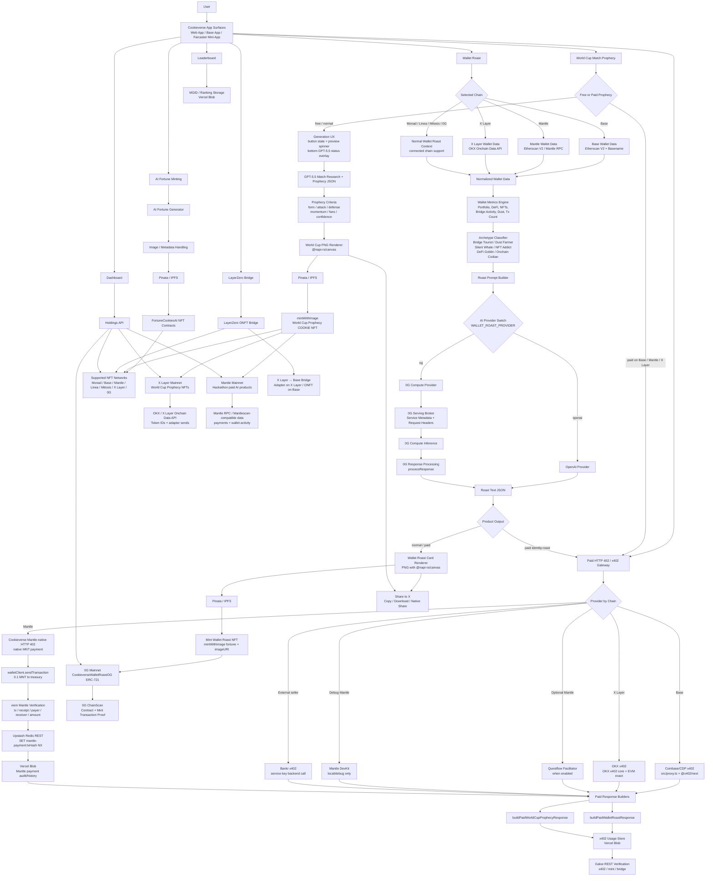

# 🍪 Cookieverse

<p align="center">
  
</p>

<p align="center">
  <b>Cookieverse turns wallets into AI-powered social identities: fortune NFTs, chain-aware Wallet Roast cards, paid HTTP 402/x402 products on Base, Mantle and X Layer, World Cup prophecy NFTs, cross-chain COOKIEs, dashboards, Galxe tasks, and leaderboards.</b>
</p>

<p align="center">
  
  
  
  
</p>

<p align="center">
  
  
  
  
  
  
  
</p>

---

## Cookieverse Overview

Cookieverse is a consumer crypto app that makes onchain activity fun, visual, collectible, and shareable.

Users can generate AI fortunes, mint COOKIE NFTs, roast wallets across supported chains, render beautiful share cards, unlock paid Wallet Roast and World Cup Prophecy products through x402-style payment flows, create GPT-5.5-powered World Cup match prophecy NFTs with visible generation progress, bridge COOKIE NFTs across supported chains, complete Galxe-verifiable tasks, track activity in a dashboard, and compete on leaderboards.

Cookieverse is built as a multi-surface product:

- Main web app
- Base App compact experience
- Farcaster Mini App routes
- Cross-chain NFT bridge
- Wallet Roast identity layer
- World Cup Match Prophecy layer
- NFT minting and social sharing flows

The product goal is simple:

> Make wallet activity and cultural moments feel like social identity, not just block explorer history.

---

## Mantle Turing Test Hackathon 2026 Focus

Cookieverse is being prepared for the Mantle Turing Test Hackathon 2026 on DoraHacks:

```txt
https://dorahacks.io/hackathon/mantleturingtesthackathon2026
```

The hackathon is described as a two-phase AI competition backed by Mantle ecosystem partners, with Phase 2, **AI Awakening**, focused on Human vs. AI mechanisms across six tracks. Cookieverse aligns most directly with:

```txt
Consumer & Viral DApps:
  Gamified, shareable consumer applications.

Agentic Wallets & Economy:
  Wallet-centered economies and paid AI actions.

AI x on-chain infrastructure:
  AI outputs become verifiable paid, rendered, mintable artifacts.
```

The Mantle-facing submission focus is:

```txt
Mantle-native AI consumer payments:
  Native MNT HTTP 402 payment gate
  Wallet Roast on Mantle
  World Cup Match Prophecy on Mantle
  Rendered PNG collectibles
  NFT minting through mintWithImage()
  Upstash Redis replay protection
  Vercel Blob audit/payment history
```

Why this matters for the hackathon:

1. Cookieverse uses Mantle mainnet, not only a mocked payment screen.
2. Users pay native `MNT` for AI-generated products.
3. The backend verifies Mantle transactions with `viem`.
4. Each transaction hash can unlock only one paid result through an atomic Redis replay lock.
5. Paid results are real Cookieverse artifacts: rendered Wallet Roast cards and World Cup Prophecy cards ready for IPFS and NFT minting.
6. The app is consumer-facing and viral by design: every paid AI result can be downloaded, copied, shared on X, and minted.
7. The payment trail, mint trail, and activity layer make the AI outcome inspectable on-chain.

Mantle DevKit remains useful for experimentation, but the production Mantle path is now Cookieverse's own Mantle-native HTTP 402 flow because the DevKit path was observed returning repeated `402 Payment Required` on Mantle mainnet retries.

Current Mantle implementation files:

```txt
src/lib/server/mantleNative402.ts
src/app/api/x402/mantle-native/wallet-roast/identity/route.ts
src/app/api/x402/mantle-native/xcup/prophecy/route.ts
src/lib/x402/client.ts
src/lib/x402/config.ts
docs/mantle-x402-facilitator-guide.md
```

---

## Feature Snapshot

| Area | What it does |
| --- | --- |
| 🍪 AI Fortunes | Generate short AI fortune text and mint it as a COOKIE NFT. |
| 🖼️ AI Image Mints | Generate or upload image-based COOKIE NFTs with IPFS metadata. |
| ⚽ World Cup Prophecy | GPT-5.5 researches historical match context, creates a World Cup-style prophecy, renders a collectible PNG card, and mints it as a COOKIE NFT. Supports paid x402-style flows on Base, Mantle, and X Layer where enabled. |
| 🏟️ Prophecy Generation UX | Shows compact progress states while GPT-5.5 works: button state, preview spinner/progress, bottom status overlay, and research → criteria → render stage messages. |
| 🔐 Hidden Prophecy Prompt | Stores the full World Cup prophecy prompt in server-only env `XCUP_PROPHECY_PROMPT_SECRET`, not in GitHub and not in the frontend bundle. |
| 🧾 Strict Prophecy JSON | Supports schema-driven, card-ready prophecy JSON so the renderer receives structured data instead of free-form AI prose. |
| 🌍 World Cup Team Selector | Team 1 / Team 2 inputs support searchable World Cup teams, aliases, real flag images, and manual custom typing. |
| 🏳️ Real Flag Rendering | Uses real flag images in the UI and rendered cards instead of emoji flags, avoiding broken Windows / Node canvas flag rendering. |
| 🖼️ Prophecy Card Renderer | Uses `@napi-rs/canvas` and World Cup templates to render premium match prophecy cards server-side. |
| 🟣 X Layer Mainnet | Supports X Layer wallet connection, Wallet Roast, World Cup prophecy minting, NFT holdings, dashboard, leaderboard, bridge activity, and OKX x402 payments. |
| 🟢 Mantle Mainnet | Supports Wallet Roast and World Cup Prophecy paid with native MNT through Cookieverse HTTP 402, plus COOKIE NFT support, holdings, dashboard, leaderboard and bridge activity. |
| 🌉 X Layer → Base Bridge | Bridges COOKIE NFTs from X Layer to Base through LayerZero adapter / ONFT contracts. |
| 🔥 Wallet Roast | Analyze Base, Mantle, or X Layer wallet activity and turn it into a funny AI identity roast card. Normal Wallet Roast remains available on Monad, Linea, Mitosis, and 0G. |
| 🧠 Wallet Archetypes | Classify wallets as Bridge Tourist, Dust Farmer, Silent Whale, NFT Addict, DeFi Goblin, or Onchain Civilian. |
| 🤖 AI Providers | Uses 0G Compute by default and can route Wallet Roast generation through OpenAI. |
| ⛓️ 0G Mainnet | Supports Wallet Roast NFT minting on 0G Mainnet for product expansion and hackathon proof. |
| 🌉 LayerZero Bridge | Bridges COOKIE NFTs across supported networks, including the focused X Layer → Base route. |
| 🔵 Base App | Mobile-first compact Cookieverse shell for Base App users. |
| 🟣 Farcaster Mini App | Dedicated `/mini` routes for Farcaster Mini App contexts. |
| 🏆 Leaderboard | Ranks users by Cookieverse activity: mints, x402 payments, bridges. |
| 📊 Dashboard | Tracks holdings, image mints, x402 payments, quests, boosts, and activity. |
| X Auth Modes | Supports popup-based Connect X in the nav plus configurable `XAUTH=V2`, `XAUTH=V1`, or `XAUTH=DISABLED` login gating. |
| 🐦 X Sharing | Lets users share generated cards, mints, and roast content on X. |
| 💳 Paid HTTP 402 / x402 Products | Supports paid Wallet Roast and World Cup Prophecy across Coinbase/CDP x402 on Base, Cookieverse native MNT HTTP 402 on Mantle, and OKX x402 on X Layer. |
| 🏦 Coinbase x402 | Cookieverse acts as the x402 seller for Base paid routes protected by `src/proxy.ts`. |
| 🟢 Mantle Native 402 | Cookieverse verifies native MNT payments on Mantle mainnet, locks tx hashes in Upstash Redis, and writes Blob audit/payment history. |
| 🟣 OKX x402 | Cookieverse supports OKX x402 paid Wallet Roast and World Cup Prophecy on X Layer. |
| 🤖 Bankr x402 | Bankr Cloud can act as an external seller and call Cookieverse paid backend after payment. |
| ✅ Galxe REST Tasks | Verifies x402 usage, COOKIE minting, and bridge activity for Galxe campaigns. |

---

## App Surfaces

### Main Web App

Routes:

```txt
/
 /bridge
 /dashboard
 /leaderboard
 /mgid-leaderboard
```

The main web app includes AI fortune minting, World Cup Match Prophecy, Wallet Roast, NFT minting, bridge flows, dashboards, and leaderboards.

### Base App

Routes:

```txt
/app
/app/bridge
/app/dashboard
/app/leaderboard
```

The Base App surface is a compact mobile/tablet experience. It uses a dedicated shell and layout constraints to make Cookieverse usable inside Base App-style environments. It also includes a compact World Cup header/banner and the same World Cup Prophecy flow.
Base App-specific World Cup UI updates:

```txt
- World Cup header image is centered between Cookieverse branding and X profile controls.
- Header image is responsive and uses contain-style sizing to avoid cutting.
- Date badge is visible and World Cup-themed.
- Team selector remains compact for mobile/Base App layout.
- Sharing favors copy/download/native share flows where supported.
```


### Farcaster Mini App

Routes:

```txt
/mini
/mini/bridge
/mini/dashboard
/mini/leaderboard
/mini/smartaccount
```

The Farcaster Mini App surface uses dedicated mini routes, metadata, compact navigation, and Mini App providers.

---

## System Architecture



---

## Core Product Flows

### 1. AI Fortune Minting

User flow:

```txt
User enters topic / vibe / optional name
→ Cookieverse generates a short AI fortune
→ User mints the fortune through FortuneCookiesAI
→ NFT appears in holdings and dashboard
```

Important app areas:

```txt
src/app/page.tsx
src/app/api/fortune/route.ts
src/app/api/images/route.ts
src/app/api/pinata/route.ts
src/abi/FortuneCookiesAI.json
```

---

### 2. World Cup Match Prophecy on X Layer

World Cup Match Prophecy is the main X Layer Build X Hackathon-facing feature.

It turns a simple match input into a collectible AI-powered NFT card. The feature is designed as a premium sports + AI + NFT flow: GPT-5.5 may take longer than a smaller model, so the UI clearly shows that research, criteria calculation, and card rendering are in progress.

User flow:

```txt
Open Cookieverse
→ Connect wallet
→ Switch to X Layer Mainnet
→ Enter Team 1
→ Enter Team 2
→ Select match date
→ Click Create Match Prophecy
→ UI shows GPT-5.5 progress: button loading state, preview spinner and bottom status overlay
→ AI generates match prophecy JSON
→ Server renders World Cup prophecy card PNG
→ User can download, copy, share on X, or mint
→ Mint Prophecy uploads image to IPFS and calls mintWithImage()
```

The user does not manually write match context or choose criteria. The AI agent creates the context and criteria itself.

Generated prophecy cards include:

```txt
Team 1
Team 2
Match date
Pick
Score
Confidence
Prophecy text
Inline risk explanations
Short reasoning line
Criteria scores
```

Prophecy criteria:

```txt
Form
Attack
Defense
Momentum
Fans
Confidence
```

Important implementation areas:

```txt
src/app/page.tsx
src/app/api/xcup/prophecy/route.ts
src/app/api/xcup/render/route.ts
src/lib/xcup/types.ts
src/lib/xcup/renderProphecyCard.ts

public/xcup/world-cup-prophecy-template.png
public/xcup/world-cup-header-desktop.png
public/xcup/world-cup-header-mobile.png
```

The rendered card uses `@napi-rs/canvas`, local template assets, local fonts, and tunable layout boxes, following the same server-side image-rendering architecture as Wallet Roast.


#### World Cup Prophecy Generation UX

The World Cup Prophecy feature intentionally keeps `gpt-5.5` as the recommended model for hackathon/demo quality.

```bash
XCUP_OPENAI_MODEL=gpt-5.5
XCUP_RENDER_DEBUG_BOXES=0
```

Because `gpt-5.5` can take longer than smaller models, Cookieverse now treats generation as a visible product flow instead of a silent wait.

During generation, users see:

```txt
Button state:
  AI is creating prophecy…

Preview state:
  Spinner + progress indicator inside the card preview area

Bottom overlay:
  GPT-5.5 prophecy status while the request is running

Stage messages:
  research → criteria → render
```

The earlier large inline “Prophecy engine running” box was removed because it made the prophecy card UI too heavy. The final UX keeps compact indicators that make the wait understandable without breaking the layout.

Generation stages:

```txt
researching:
  GPT-5.5 is studying previous matches, team style and tournament context.

scoring:
  Cookieverse calculates form, attack, defense, momentum, fan signal and confidence.

rendering:
  Cookieverse renders the final collectible World Cup prophecy PNG card.

ready:
  The prophecy card is ready to download, copy, share, upload to IPFS, or mint on X Layer.
```

Important UI state in `src/app/page.tsx`:

```tsx
type WorldCupStage =
  | 'idle'
  | 'researching'
  | 'scoring'
  | 'rendering'
  | 'ready'
  | 'error';

const [wcBusy, setWcBusy] = React.useState(false);
const [wcStage, setWcStage] = React.useState<WorldCupStage>('idle');
const [wcStartedAt, setWcStartedAt] = React.useState<number | null>(null);
const [wcElapsedSec, setWcElapsedSec] = React.useState(0);
```

This UX is part of the product, not only a loading spinner. It helps reviewers understand that Cookieverse is running an AI research → criteria → render pipeline before producing the mintable image.


#### World Cup Prophecy AI Flow

Cookieverse uses OpenAI for World Cup prophecy generation. The recommended hackathon model is `gpt-5.5` because the feature is a premium collectible experience where prophecy quality matters more than raw speed. The model can still be changed through `XCUP_OPENAI_MODEL` without code changes.

Endpoint:

```txt
POST /api/xcup/prophecy
```

Input:

```json
{
  "homeTeam": "Argentina",
  "awayTeam": "Spain",
  "matchDate": "2026-07-20"
}
```

Output shape:

```json
{
  "title": "World Cup Match Prophecy",
  "homeTeam": "Argentina",
  "awayTeam": "Spain",
  "matchDate": "2026-07-20",
  "location": "",
  "pick": "Argentina",
  "scoreline": "2-1",
  "confidence": 78,
  "prophecy": "Argentina edges a tense final with sharper control in key moments...",
  "drawRisk": "Medium",
  "counterAttackRisk": "Medium",
  "cleanSheetRisk": "Medium",
  "reasoning": [
    "Form edge and transition balance shape the call.",
    "Momentum and big-match mentality decide the edge."
  ],
  "research": {
    "matchDate": "2026-07-20",
    "competition": "World Cup",
    "recentForm": "",
    "keyPlayers": "",
    "injuriesOrSuspensions": "",
    "fanSentiment": "",
    "tacticalContext": "",
    "sources": []
  },
  "criteria": {
    "form": 72,
    "attack": 75,
    "defense": 66,
    "momentum": 78,
    "fans": 58,
    "confidenceSignal": 78
  }
}
```

The endpoint uses the existing Cookieverse OpenAI key pattern:

```bash
MFC_OPENAI_KEY_NAME=OPENAI_API_KEY_MFC_NEW
OPENAI_API_KEY_MFC_NEW=sk-...
XCUP_OPENAI_MODEL=gpt-5.5
```

#### World Cup Team Selector and Flags

The World Cup Prophecy UI now uses searchable team inputs instead of plain text-only fields.

Team selector behavior:

```txt
Team 1 / Team 2 start empty
→ user can search by country name, code, nickname or alias
→ user can select from World Cup teams with flag images
→ user can still manually type custom teams
→ selected names are passed into prophecy generation and card rendering
```

Implementation areas:

```txt
src/app/page.tsx
src/lib/xcup/worldCupTeams.ts
src/lib/xcup/renderProphecyCard.ts
```

The renderer does not rely on emoji flags. It draws real PNG flags separately from the team text.

Reason:

```txt
emoji flags are unreliable in Windows browsers and @napi-rs/canvas
they can render as AR / FR / SN or broken glyphs
real flag images create stable social-share and NFT images
```

#### Hidden World Cup Prophecy Prompt

The full World Cup prophecy prompt is private and server-only.

It must be stored in:

```bash
XCUP_PROPHECY_PROMPT_SECRET="..."
```

Do not use:

```bash
NEXT_PUBLIC_XCUP_PROPHECY_PROMPT_SECRET
```

because every `NEXT_PUBLIC_*` variable can be exposed to the frontend bundle.

The private prompt uses placeholders:

```txt
{{HOME_TEAM}}
{{AWAY_TEAM}}
{{MATCH_DATE}}
```

The API route replaces those placeholders server-side before calling OpenAI:

```ts
function replacePromptPlaceholders(template: string, input: WorldCupProphecyInput) {
  return template
    .replaceAll('{{HOME_TEAM}}', input.homeTeam)
    .replaceAll('{{AWAY_TEAM}}', input.awayTeam)
    .replaceAll('{{MATCH_DATE}}', input.matchDate);
}
```

Cookieverse also appends public-card readability rules in the server route. The model should return a concise collectible prophecy, not sportsbook-style market output:

```txt
- Keep prophecy concise: 180-240 characters.
- Return risk levels as top-level JSON fields using full words only: Low, Medium, High, Low-Medium, Medium-High.
- Do not use abbreviations like L, M, H, LM, or MH on the public card.
- Supported risk fields: drawRisk, upsetRisk, counterAttackRisk, setPieceRisk, cleanSheetRisk, lateGoalRisk, heatFatigueRisk, travelDisruptionRisk.
- Reasoning must contain exactly 2 short lines, each under 70 characters.
```

For local `.env.local`, use one quoted value with `\n` escapes if multiline parsing causes only the first line to load.

For Vercel, store the full prompt in the Environment Variables dashboard.

#### World Cup Model Strategy

The World Cup prophecy model is configurable:

```bash
XCUP_OPENAI_MODEL=gpt-5-mini
```

Recommended strategy:

```txt
gpt-5-mini:
  production default; best cost / intelligence / speed balance

gpt-5.5:
  premium demo mode; best writing quality, higher cost
```

The endpoint can also tune web search cost through `search_context_size`:

```ts
tools: [
  {
    type: 'web_search',
    search_context_size: 'low',
  },
]
```

Use `medium` when quality is more important than cost.

#### World Cup Card Rendering

Endpoint:

```txt
POST /api/xcup/render
```

Rendering flow:

```txt
WorldCupProphecyResult JSON
→ renderWorldCupProphecyCard()
→ load public/xcup/world-cup-prophecy-template.png
→ draw teams, date, summary, prophecy with inline risks, reasoning and criteria
→ add decorative divider lines
→ return image/png
```

The current card design includes:

- World Cup stadium theme
- Gold trophy visual language
- Cookieverse footer
- Team names aligned with the VS ribbon
- Summary / prophecy with inline risk explanations / reasoning layered with decorative gold dividers
- Criteria boxes aligned under template icons
- IPFS-ready PNG output

Debug layout boxes can be enabled locally:

```bash
XCUP_RENDER_DEBUG_BOXES=1
```

Disable for production:

```bash
XCUP_RENDER_DEBUG_BOXES=0
```

---

### 3. Wallet Roast

Wallet Roast turns a wallet into a shareable AI identity card.

User flow:

```txt
User pastes a Base wallet or uses connected wallet
→ Cookieverse fetches Base wallet activity
→ Wallet metrics are computed
→ Wallet is classified into an archetype
→ AI generates roast text
→ Cookieverse renders a PNG roast card
→ User can copy, download, share, or mint the card
```

Important app areas:

```txt
src/app/api/wallet-roast/analyze/route.ts
src/app/api/wallet-roast/render/route.ts
src/lib/wallet-roast/analyzeWalletRoast.ts
src/lib/wallet-roast/fetchBaseWalletData.ts
src/lib/wallet-roast/normalizeWalletData.ts
src/lib/wallet-roast/computeMetrics.ts
src/lib/wallet-roast/classifyArchetype.ts
src/lib/wallet-roast/buildTags.ts
src/lib/wallet-roast/buildTraits.ts
src/lib/wallet-roast/buildRoastPrompt.ts
src/lib/wallet-roast/generateRoast.ts
src/lib/wallet-roast/generateOpenAIRoast.ts
src/lib/wallet-roast/generateOgRoast.ts
src/lib/wallet-roast/renderCard.ts
```

Supported Wallet Roast archetypes:

```txt
Bridge Tourist
Dust Farmer
Silent Whale
NFT Addict
DeFi Goblin
Onchain Civilian
```

---

### 3.1 Paid HTTP 402 / x402 Products

Cookieverse supports paid AI products through chain-specific HTTP 402 / x402 flows.

```txt
Wallet Roast:
  roast-json
  identity-roast

World Cup Match Prophecy:
  xcup-prophecy
```

| Product | Purpose | Output |
| --- | --- | --- |
| `roast-json` | Fast paid Wallet Roast API | Archetype, scores, tags, traits, headline, light roast, savage roast, verdict |
| `identity-roast` | Full paid onchain identity roast | Roast JSON, rendered PNG card, IPFS image, NFT-ready metadata |
| `xcup-prophecy` | Full paid World Cup prophecy | Prophecy JSON, rendered PNG card, IPFS image, NFT-ready metadata |

Cookieverse supports multiple paid providers:

| Provider | Seller | Flow |
| --- | --- | --- |
| Coinbase/CDP x402 | Cookieverse | Base paid routes are protected by `src/proxy.ts`. Payment is verified through Coinbase/CDP x402 before route logic runs. |
| Cookieverse Mantle-native HTTP 402 | Cookieverse | Mantle users pay native `MNT`; Cookieverse verifies the Mantle tx with `viem`, locks tx hash replay in Upstash Redis, and records Blob audit/payment history. |
| OKX x402 | Cookieverse + OKX | X Layer paid routes use OKX x402 client/server libraries and require a confirmed settlement response. |
| Questflow x402 | Questflow | Optional Mantle provider when facilitator access is available. Disabled unless explicitly selected. |
| Mantle DevKit x402 | Mantle DevKit | Debug/experimental only. Not recommended for Mantle mainnet production because mainnet retries were observed returning repeated `402`. |
| Bankr x402 | Bankr Cloud | Frontend or agents call Bankr x402 endpoints. Bankr verifies payment, then calls Cookieverse `/api/wallet-roast/pro` with `COOKIEVERSE_SERVICE_KEY`. |

Coinbase x402 route flow:

```txt
User
→ Cookieverse frontend
→ /api/x402/coinbase/wallet-roast/json
→ src/proxy.ts with @x402/next
→ Coinbase/CDP facilitator
→ buildPaidWalletRoastResponse()
→ x402 usage recorded in Vercel Blob
```

Mantle-native HTTP 402 route flow:

```txt
User on Mantle
→ Cookieverse frontend
→ /api/x402/mantle-native/wallet-roast/identity
   or /api/x402/mantle-native/xcup/prophecy
→ API returns HTTP 402 with MNT payment requirement
→ walletClient.sendTransaction({ to: MANTLE_PAY_TO, value: 0.1 MNT })
→ frontend retries original request with paymentTxHash
→ requireMantleNativePayment()
→ Mantle RPC / viem transaction + receipt verification
→ Upstash Redis SET mantle-payment:{txHash} NX
→ optional Vercel Blob audit/payment history
→ buildPaidWalletRoastResponse() or buildPaidWorldCupProphecyResponse()
→ rendered PNG + metadata returned
```

OKX X Layer x402 route flow:

```txt
User on X Layer
→ Cookieverse frontend
→ /api/x402/okx/wallet-roast/identity
   or /api/x402/okx/xcup/prophecy
→ OKX x402 payment payload is signed
→ Cookieverse verifies/settles with OKX x402 server libraries
→ paid result is returned only after settlement response confirms transfer
```

Bankr x402 route flow:

```txt
User / agent
→ https://x402.bankr.bot/.../cookieverse-roast-json
→ Bankr x402 payment verification
→ Bankr service calls /api/wallet-roast/pro
→ requireCookieverseServiceKey()
→ buildPaidWalletRoastResponse()
→ x402 usage recorded in Vercel Blob
```

Important implementation areas:

```txt
src/proxy.ts
src/lib/x402/config.ts
src/lib/x402/client.ts
src/app/api/x402/coinbase/wallet-roast/json/route.ts
src/app/api/x402/coinbase/wallet-roast/identity/route.ts
src/app/api/x402/coinbase/xcup/prophecy/route.ts
src/app/api/x402/mantle-native/wallet-roast/identity/route.ts
src/app/api/x402/mantle-native/xcup/prophecy/route.ts
src/app/api/x402/okx/wallet-roast/identity/route.ts
src/app/api/x402/okx/xcup/prophecy/route.ts
src/app/api/wallet-roast/pro/route.ts
src/lib/wallet-roast/buildPaidWalletRoastResponse.ts
src/lib/xcup/buildPaidWorldCupProphecyResponse.ts
src/lib/server/mantleNative402.ts
src/lib/server/okxX402.ts
src/server/x402UsageStore.ts
x402/cookieverse-roast-json/index.ts
x402/cookieverse-identity-roast/index.ts
```

Security model:

```txt
Coinbase x402:
  Payment is verified by Cookieverse x402 proxy.

Cookieverse Mantle-native HTTP 402:
  Payment is a native MNT transfer on Mantle mainnet.
  Backend verifies tx hash, payer, receiver, value, chain, receipt status.
  Upstash Redis atomic SET NX prevents tx hash replay.
  Vercel Blob records audit/payment history after verification.

OKX x402:
  Payment is verified and settled through OKX x402 libraries.
  Cookieverse requires a settlement response before treating the request as paid.

Bankr x402:
  Payment is verified by Bankr.
  Cookieverse only accepts Bankr backend calls to /api/wallet-roast/pro
  when X-Cookieverse-Service-Key matches COOKIEVERSE_SERVICE_KEY.

Galxe:
  REST verification endpoints require access-token or accepted secret header.
```

---

### 3.2 x402 Troubleshooting

Normal first x402 response:

```txt
HTTP 402 Payment Required
payment-required: <base64 challenge>
```

This is expected. The browser client signs the payment and retries with:

```txt
payment-signature: <signed x402 payload>
```

If the second request still returns `402`, decode the `payment-required` header to find the real reason.

Common payment failure:

```txt
invalid_payload: contract call failed: unable to call contract: execution reverted
```

Most likely causes:

```txt
- connected wallet does not have enough native Base USDC
- wrong wallet/account signed the x402 payload
- wrong network
- stale payment payload
- USDC token is not native Base USDC
```

Required token for Coinbase x402 Base payments:

```txt
Base USDC:
0x833589fCD6eDb6E08f4c7C32D4f71b54bDA02913
```

Current paid product pricing in `src/proxy.ts`:

```txt
roast-json: $0.02
identity-roast: $0.07
```

Recommended frontend improvement:

```ts
function decodePaymentRequiredHeader(response: Response): string | null {
  const raw =
    response.headers.get('payment-required') ||
    response.headers.get('PAYMENT-REQUIRED');

  if (!raw) return null;

  try {
    const decoded = window.atob(raw);
    const parsed = JSON.parse(decoded);
    return parsed?.error ? String(parsed.error) : null;
  } catch {
    return null;
  }
}
```

### 4. Wallet Roast Card Rendering

Cookieverse renders Wallet Roast cards server-side using `@napi-rs/canvas`.

Card assets:

```txt
public/wallet-roast/templates/
public/wallet-roast/icons/stats/
public/wallet-roast/icons/tags/
```

Output:

```txt
PNG roast card
Shareable image
IPFS image for NFT minting
```

---

### 5. Cross-chain COOKIE Bridge

Cookieverse supports bridging COOKIE NFTs across supported networks using LayerZero ONFT-style bridge flows.

Bridge routes:

```txt
/bridge
/app/bridge
/mini/bridge
```

Bridge-related environment groups:

```txt
NEXT_PUBLIC_ADAPTER_*
NEXT_PUBLIC_ONFT_*
NEXT_PUBLIC_CANONICAL_ERC721*
NEXT_PUBLIC_EID_*
NEXT_PUBLIC_FLAT_FEE_WEI_*
NEXT_PUBLIC_APP_FEE_BPS
NEXT_PUBLIC_FEE_RECEIVER
```

#### LayerZero Bridge: X Layer to Base

For the hackathon version, Cookieverse supports a focused bridge route:

```txt
X Layer → Base
```

Contract model:

```txt
X Layer:
  FortuneCookiesONFTAdapter

Base:
  FortuneCookiesONFT
```

Bridge flow:

```txt
COOKIE NFT minted on X Layer
→ user opens /bridge or /app/bridge
→ source chain is X Layer
→ destination chain is Base
→ user previews token ID
→ user approves adapter if needed
→ user bridges through LayerZero
→ bridge transaction is counted in adapter-sends
```

Important app areas:

```txt
src/app/bridge/page.tsx
src/app/app/bridge/page.tsx
src/app/api/fc-token-ids/route.ts
src/app/api/adapter-sends/route.ts
```

Important configuration groups:

```bash
NEXT_PUBLIC_CANONICAL_ERC721_XLAYER=0x...
NEXT_PUBLIC_ADAPTER_XLAYER=0x...
NEXT_PUBLIC_ONFT_BASE=0x...

NEXT_PUBLIC_EID_XLAYER=30274
NEXT_PUBLIC_EID_BASE=30184

NEXT_PUBLIC_FLAT_FEE_WEI_OKB=0
NEXT_PUBLIC_FLAT_FEE_WEI_ETH=0
NEXT_PUBLIC_APP_FEE_BPS=0
NEXT_PUBLIC_FEE_RECEIVER=0x...
```

LayerZero proof placeholders:

```txt
X Layer adapter contract: 0xdC4538763F8Ec6cB628684d8421B470735d8319a
Base ONFT contract: 0x7e579E8D744bA7a3D62b9ABC43eD165bFE3f2688
X Layer → Base bridge tx: 0x7e579E8D744bA7a3D62b9ABC43eD165bFE3f2688
LayerZero Scan link: https://layerzeroscan.com/tx/0xd4520802ff5283022ebf7c2006133ae32ac086c0bf324d70b64dc6a3aff71c5a
```

---

### 6. X Layer NFT Token ID Indexing

For X Layer, Cookieverse should not rely on slow block scanning.

Instead, X Layer token IDs are fetched through the OKX / X Layer Onchain Data API.

Endpoint used by Cookieverse:

```txt
GET /api/v5/xlayer/address/token-balance
```

Purpose:

```txt
Fetch ERC-721 token IDs held by connected user on X Layer
```

Cookieverse route:

```txt
GET /api/fc-token-ids?chain=xlayer&owner=0x...
```

Expected behavior:

```txt
Connected wallet
→ /api/fc-token-ids
→ OKX X Layer token-balance API
→ filter by NEXT_PUBLIC_CANONICAL_ERC721_XLAYER
→ return tokenIds[]
```

This is used for holdings, NFT preview, dashboard and bridge UX.

---

### 7. X Layer Adapter Send Counting

Bridge activity from X Layer is counted through X Layer transaction data instead of block scanning.

Endpoint used by Cookieverse:

```txt
GET /api/v5/xlayer/address/token-transaction-list
```

Purpose:

```txt
Count ERC-721 transfers from user wallet to NEXT_PUBLIC_ADAPTER_XLAYER
```

Cookieverse route:

```txt
GET /api/adapter-sends?address=0x...
```

Expected behavior:

```txt
User wallet
→ /api/adapter-sends
→ OKX X Layer token-transaction-list API
→ filter tokenContractAddress = NEXT_PUBLIC_CANONICAL_ERC721_XLAYER
→ filter from = user
→ filter to = NEXT_PUBLIC_ADAPTER_XLAYER
→ count bridge send transactions
```

This provides bridge activity proof without expensive `eth_getLogs` scans.

---

### 8. Dashboard and Leaderboard

Cookieverse tracks user activity across mints, image mints, holdings, quests, boosts, X Layer World Cup Prophecy NFTs, and ranking data.

`/api/mgid-upsert` separates wallet activity refreshes from trusted identity writes. Wallet-only requests can refresh public onchain stats, while an X session, Quick Auth bearer token, or Mini App identity header is required before usernames or the stored smart-account wallet can be attached. Existing identity fields are preserved, and no-op updates return `{ ok: true, changed: false }` when score, bridge, x402, daily/weekly, and identity values are unchanged.

Important app areas:

```txt
src/app/dashboard/ui/DashboardClient.tsx
src/app/leaderboard/ui/LeaderboardClient.tsx
src/app/mgid-leaderboard/ui/MgidLeaderboardClient.tsx
src/server/mgidStore.ts
src/app/api/holdings/route.ts
src/app/api/mgid-get/route.ts
src/app/api/mgid-upsert/route.ts
src/app/api/mgid-downsert/route.ts
src/app/api/mgid-leaderboard/route.ts
src/app/api/mgid-boosts/route.ts
src/app/api/leaderboard/route.ts
```

---

## Hackathon Proof: X Layer Integration

Fill this section after deployment.

```txt
Hackathon: X Layer Build X / X Cup
Project: Cookieverse World Cup Match Prophecy
Live app: https://www.cookieverse.tech/
GitHub: https://github.com/mssystem1/cookieverse

X Layer component:
- X Layer Mainnet wallet connection
- X Layer COOKIE NFT minting
- World Cup prophecy NFT card minting
- GPT-5.5 generation-progress UX for the AI research → criteria → render flow
- X Layer holdings / token ID indexing
- X Layer leaderboard and dashboard support
- X Layer → Base LayerZero bridge route

X Layer Chain ID:
196

X Layer RPC:
https://rpc.xlayer.tech

World Cup Prophecy Contract:
0x114252793390F60ab3302d3ff6b229382Ac3AA32

World Cup Prophecy mint transaction:
0x986f921d556e31f543265a4002c6b4256b5e0f6351f9a06fba591548fad89bda

X Layer explorer link:
https://web3.okx.com/explorer/x-layer/evm/tx/0x986f921d556e31f543265a4002c6b4256b5e0f6351f9a06fba591548fad89bda

Minted token ID:
5

Minted IPFS image:
IPFS: ipfs://QmSUdJHKFbfoYStDebb7hnq4fx3CPwADVhq8HEFB5FQJqJ

LayerZero X Layer → Base Bridge:
X Layer adapter: 0xdC4538763F8Ec6cB628684d8421B470735d8319a
Base ONFT: 0x7e579E8D744bA7a3D62b9ABC43eD165bFE3f2688
Bridge tx: 0x5fdcb500b9b05073a54a850183d3468df93a28b142c5b147a4ecf0c569a4a08b
LayerZero Scan: https://layerzeroscan.com/tx/0x5fdcb500b9b05073a54a850183d3468df93a28b142c5b147a4ecf0c569a4a08b
```

Why this proves X Layer integration:

1. User connects to X Layer Mainnet inside Cookieverse.
2. User generates a World Cup Match Prophecy card with visible GPT-5.5 progress states.
3. Cookieverse renders the prophecy as a PNG card.
4. Cookieverse uploads the card to IPFS.
5. User mints the card through `mintWithImage()` on X Layer.
6. Cookieverse reads X Layer NFT IDs through X Layer/OKX onchain data.
7. Cookieverse can bridge COOKIE NFTs from X Layer to Base through LayerZero.
8. Dashboard and leaderboard use the same Cookieverse activity layer to display the X Layer activity.

---

## Reviewer Test Flow

A reviewer can test the hackathon feature as follows:

```txt
1. Open Cookieverse.
2. Connect wallet.
3. Switch to X Layer Mainnet.
4. Enter a match, for example Argentina vs Spain.
5. Select match date.
6. Click Create Match Prophecy.
7. Confirm the generated World Cup prophecy card preview.
8. Click Mint Prophecy.
9. Confirm wallet transaction.
10. Open X Layer explorer transaction.
11. Check minted token in Cookieverse dashboard / holdings.
12. Optionally bridge the NFT from X Layer to Base.
```

Local API tests:

```bash
curl -X POST "http://127.0.0.1:3000/api/xcup/prophecy" \
  -H "content-type: application/json" \
  -d '{
    "homeTeam": "Argentina",
    "awayTeam": "Spain",
    "matchDate": "2026-07-20"
  }'

curl -X POST "http://127.0.0.1:3000/api/xcup/render" \
  -H "content-type: application/json" \
  -d '{
    "title": "World Cup Match Prophecy",
    "homeTeam": "Argentina",
    "awayTeam": "Spain",
    "matchDate": "2026-07-20",
    "pick": "Argentina",
    "scoreline": "2-1",
    "confidence": 78,
    "prophecy": "Argentina edges a tense final with sharper control in key moments.",
    "reasoning": [
      "Form edge and transition balance shape the call.",
      "Momentum and big-match mentality decide the edge."
    ],
    "research": {
      "matchDate": "2026-07-20",
      "competition": "World Cup",
      "sources": []
    },
    "criteria": {
      "form": 72,
      "attack": 75,
      "defense": 66,
      "momentum": 78,
      "fans": 58,
      "confidenceSignal": 78
    },
    "mintedBy": "0x0000000000000000000000000000000000000000"
  }' \
  --output world-cup-prophecy.png
```

Expected render response:

```txt
Content-Type: image/png
Output: World Cup prophecy PNG card
```
Windows PowerShell note:

```txt
Use curl.exe, not curl.
PowerShell aliases curl to Invoke-WebRequest, which breaks -H and --json syntax.
```


---

## Galxe Campaign Verification

Cookieverse includes REST endpoints for Galxe task verification. These endpoints let Galxe verify whether a wallet has completed Cookieverse actions.

Supported Galxe tasks:

| Endpoint | Campaign use case | Data source |
| --- | --- | --- |
| `/api/galxe/x402` | Verify paid x402 Wallet Roast usage | `src/server/x402UsageStore.ts` / Vercel Blob |
| `/api/galxe/mint` | Verify COOKIE NFT mint activity | Holdings / mint data |
| `/api/galxe/bridge` | Verify COOKIE bridge activity | MGID / bridge activity storage |

Galxe endpoint files:

```txt
src/app/api/galxe/x402/route.ts
src/app/api/galxe/mint/route.ts
src/app/api/galxe/bridge/route.ts
src/lib/galxe/response.ts
```

Authentication:

```txt
Galxe REST endpoints are not public.
Requests must include a valid token header.
Unauthenticated requests return 401 Unauthorized.
```

Supported auth headers:

```txt
access-token: <GALXE_ACCESS_TOKEN>
Authorization: Bearer <GALXE_ACCESS_TOKEN>
X-Galxe-Secret: <GALXE_REST_SECRET>
X-Cookieverse-Galxe-Secret: <COOKIEVERSE_GALXE_SECRET>
```

---

## 0G Integration

Cookieverse uses 0G as one part of the wider product architecture. The app is not only a 0G demo, but 0G adds an important AI and onchain minting path for Wallet Roast.

Cookieverse uses:

1. **0G Compute** for optional Wallet Roast AI text generation.
2. **0G Mainnet** for Wallet Roast NFT minting.

### 0G Compute Flow

When `WALLET_ROAST_PROVIDER=og`, Cookieverse routes Wallet Roast generation through 0G Compute.

```txt
/api/wallet-roast/analyze
→ analyzeWalletRoast()
→ generateRoast()
→ generateOgRoast()
→ createOgOpenAIClient()
→ 0G Compute provider
→ processResponse()
→ Wallet Roast JSON
→ PNG card renderer
→ IPFS upload
→ mintWithImage()
```

Important files:

```txt
src/lib/wallet-roast/generateRoast.ts
src/lib/wallet-roast/generateOgRoast.ts
src/lib/wallet-roast/ogRoastClient.ts
src/lib/wallet-roast/ogBroker.ts
src/lib/wallet-roast/config.ts
src/app/api/diag-wallet-roast-og/route.ts
scripts/check-og-compute.ts
scripts/setup-og-compute-account.ts
```

### 0G Chain Flow

Cookieverse can mint generated Wallet Roast cards on 0G Mainnet.

```txt
Wallet Roast card PNG
→ Pinata / IPFS
→ mintWithImage(fortune, imageURI)
→ CookieverseWalletRoastOG ERC-721
→ 0G Mainnet mint transaction
→ 0G ChainScan proof
```

### 0G Proof for Reviewers

```txt
0G Component: 0G Compute
0G Chain Component: 0G Mainnet NFT minting
0G Mainnet Chain ID: 16661
0G RPC: https://evmrpc.0g.ai
0G Explorer: https://chainscan.0g.ai

Contract: FortuneCookiesAI_OG
Contract address: 0x951AC8cB1524A7856B2940966AB9751c2259aF63
Contract explorer link: https://chainscan.0g.ai/address/0x951AC8cB1524A7856B2940966AB9751c2259aF63
Example Wallet Roast mint transaction: https://chainscan.0g.ai/token/0x951ac8cb1524a7856b2940966ab9751c2259af63
```

Why this proves 0G integration:

1. Runtime proof: Wallet Roast text can be generated through 0G Compute.
2. Product proof: The generated roast card is rendered and used inside the app.
3. Onchain proof: The generated roast card can be minted as an NFT on 0G Mainnet.
4. Explorer proof: The 0G ChainScan transaction shows real 0G network usage.

---

## AI Provider Configuration

Wallet Roast supports provider switching through:

```txt
WALLET_ROAST_PROVIDER
```

Supported values:

```txt
openai
og
```

Default:

```txt
0G
```

### OpenAI Provider

Used when:

```bash
WALLET_ROAST_PROVIDER=openai
```

Required variables:

```bash
OPENAI_API_KEY_MFC_NEW=sk-...
WALLET_ROAST_OPENAI_MODEL=gpt-5-mini
```

### 0G Compute Provider

Used when:

```bash
WALLET_ROAST_PROVIDER=og
```

Required variables:

```bash
OG_PRIVATE_KEY=0x...
OG_EVM_RPC_URL=https://evmrpc.0g.ai
OG_PROVIDER_ADDRESS=0x...
OG_MODEL=...
OG_LEDGER_FUND_AMOUNT=3
OG_PROVIDER_FUND_AMOUNT=2
```

Useful scripts:

```bash
npm run check:og
npm run setup:og
```

---

## World Cup Prophecy Environment

```bash
MFC_OPENAI_KEY_NAME=OPENAI_API_KEY_MFC_NEW
OPENAI_API_KEY_MFC_NEW=sk-...
XCUP_OPENAI_MODEL=gpt-5-mini
XCUP_PROPHECY_PROMPT_SECRET="..."
XCUP_RENDER_DEBUG_BOXES=0
```

`XCUP_PROPHECY_PROMPT_SECRET` is server-only and must not be committed to GitHub.

Required prompt placeholders:

```txt
{{HOME_TEAM}}
{{AWAY_TEAM}}
{{MATCH_DATE}}
```

## Supported Networks

Cookieverse currently supports or is designed around these networks:

| Network | Purpose |
| --- | --- |
| X Layer | Wallet Roast, OKX x402 paid flows, World Cup Prophecy minting, COOKIE NFT support, holdings, leaderboard and X Layer → Base bridge source. |
| Base | Base App surface, Coinbase/CDP x402 paid flows, Wallet Roast analysis, World Cup Prophecy paid wrapper, COOKIE minting and X Layer bridge destination. |
| Monad | COOKIE NFT minting and bridge route. |
| Mantle | Mantle Turing Test Hackathon 2026 focus: native MNT HTTP 402 paid Wallet Roast and World Cup Prophecy, COOKIE NFT support, holdings, dashboard, leaderboard and bridge route. |
| Linea | COOKIE NFT support and bridge route. |
| Mitosis | COOKIE NFT support. |
| 0G Mainnet | Wallet Roast NFT minting and bridge route. |

---

## Smart Contracts

### COOKIE NFT Contracts

Cookieverse uses `FortuneCookiesAI` style ERC-721 contracts for fortune and image minting.

Existing contract source repo:

```txt
https://github.com/mssystem1/mfv3-verify
```

Core functions used by the app:

```solidity
mintWithFortune(string calldata fortune)
mintWithImage(string calldata fortune, string calldata imageURI)
mintPrice()
tokenURI(uint256 tokenId)
getFortune(uint256 tokenId)
getImageURI(uint256 tokenId)
getAllMints()
```

Important note:

```txt
Cookieverse holdings API expects getAllMints().
If a deployed contract does not include getAllMints(), minting may still work,
but holdings/dashboard reads can fail.
```

### Recommended X Layer Contract

For X Layer World Cup Prophecy, use a `FortuneCookiesAI`-compatible ERC-721 contract.

Required functions for app compatibility:

```solidity
mintWithImage(string calldata fortune, string calldata imageURI)
mintWithFortune(string calldata fortune)
getAllMints()
mintPrice()
tokenURI(uint256 tokenId)
getFortune(uint256 tokenId)
getImageURI(uint256 tokenId)
```

Recommended usage:

```txt
Mint World Cup prophecy cards through mintWithImage().
Store the rendered card image as ipfs://CID.
Use the fortune string as compact match metadata:
"Argentina vs Spain | Pick: Argentina | Score: 2-1 | Confidence: 78%"
```

### Recommended X Layer → Base Bridge Contracts

```txt
X Layer:
  FortuneCookiesONFTAdapter

Base:
  FortuneCookiesONFT
```

Purpose:

```txt
Bridge COOKIE NFTs from X Layer to Base for X Layer Build X hackathon proof.
```

### Recommended 0G Contract

For 0G Mainnet, use:

```txt
CookieverseWalletRoastOG
```

Recommended constructor:

```solidity
constructor(string memory logoMIME)
```

Recommended deployment argument:

```txt
image/png
```

Recommended contract features:

```txt
ERC-721
mintWithImage()
mintWithFortune()
getAllMints()
mintPrice()
royalty support
IPFS imageURI metadata
Wallet Roast metadata attributes
```

---

## Tech Stack

| Layer | Tools |
| --- | --- |
| Frontend | Next.js 16, React 19, TypeScript |
| Wallets | Wagmi, Viem, RainbowKit |
| Auth | NextAuth with X OAuth v2, legacy Twitter OAuth v1 mode, and optional X-login gate |
| Base App | Base App metadata and compact `/app` routes |
| Farcaster | Farcaster Mini App SDK and `/mini` routes |
| AI | OpenAI SDK, 0G Serving Broker |
| Rendering | `@napi-rs/canvas` |
| Storage | Vercel Blob, Pinata / IPFS |
| Smart contracts | Solidity, ERC-721, ERC-2981, OpenZeppelin |
| Bridge | LayerZero ONFT-style routes |
| Data | Etherscan V2, Basename lookup, OKX / X Layer Onchain Data API, app APIs |

---

## Project Structure

```txt
src/
  abi/
    FortuneCookiesAI.json

  app/
    layout.tsx
    page.tsx

    app/
      page.tsx
      bridge/page.tsx
      dashboard/page.tsx
      leaderboard/page.tsx
      baseAppStyles.ts

    mini/
      page.tsx
      bridge/page.tsx
      dashboard/page.tsx
      leaderboard/page.tsx
      smartaccount/page.tsx
      head.tsx

    bridge/
      page.tsx

    dashboard/
      page.tsx
      ui/DashboardClient.tsx

    leaderboard/
      page.tsx
      ui/LeaderboardClient.tsx

    mgid-leaderboard/
      page.tsx
      ui/MgidLeaderboardClient.tsx

    api/
      fortune/route.ts
      images/route.ts
      pinata/route.ts

      xcup/
        prophecy/route.ts
        render/route.ts

      wallet-roast/
        analyze/route.ts
        render/route.ts
        pro/route.ts

      x402/
        coinbase/
          wallet-roast/
            json/route.ts
            identity/route.ts
          xcup/prophecy/route.ts
        mantle-native/
          wallet-roast/identity/route.ts
          xcup/prophecy/route.ts
        okx/
          wallet-roast/identity/route.ts
          xcup/prophecy/route.ts
        questflow/
          wallet-roast/identity/route.ts
          xcup/prophecy/route.ts

      galxe/
        x402/route.ts
        mint/route.ts
        bridge/route.ts

      diag-wallet-roast-openai/route.ts
      diag-wallet-roast-og/route.ts

      holdings/route.ts
      leaderboard/route.ts
      mgid-get/route.ts
      mgid-upsert/route.ts
      mgid-downsert/route.ts
      mgid-leaderboard/route.ts
      mgid-boosts/route.ts
      adapter-sends/route.ts
      fc-token-ids/route.ts
      auth/[...nextauth]/route.ts

  components/
    BaseAppNav.tsx
    MainChrome.tsx
    MobileBaseAppRedirect.tsx
    NavTabs.tsx
    XAuthButton.tsx
    mini/
      MiniNav.tsx
      MiniProviders.client.tsx

  hooks/
    useAppMode.ts
    useResponsiveMode.ts

  lib/
    xcup/
      types.ts
      renderProphecyCard.ts

    aa/
      clients.ts
      smartAccount.ts

    x402/
      client.ts
      config.ts

    server/
      mantleNative402.ts
      mantleDevkitX402.ts
      okxX402.ts

    galxe/
      response.ts

    wallet-roast/
      analyzeWalletRoast.ts
      buildRoastPrompt.ts
      buildTags.ts
      buildTraits.ts
      classifyArchetype.ts
      computeMetrics.ts
      config.ts
      fallbackRoast.ts
      fetchBaseWalletData.ts
      generateOpenAIRoast.ts
      generateOgRoast.ts
      generateRoast.ts
      normalizeWalletData.ts
      ogBroker.ts
      ogRoastClient.ts
      renderCard.ts
      types.ts

    auth.ts
    xAuthMode.ts
    chain.ts
    share.ts
    wagmi.ts

  server/
    mgidStore.ts
    x402UsageStore.ts

docs/
  mantle-x402-facilitator-guide.md

public/
  xcup/
    world-cup-prophecy-template.png
    world-cup-header-desktop.png
    world-cup-header-mobile.png

  wallet-roast/
    templates/
    icons/
      stats/
      tags/

scripts/
  check-og-compute.ts
  setup-og-compute-account.ts
  patch-ox.js
```

---

## Environment Variables

Create:

```txt
.env.local
```

### App and Auth

```bash
NEXTAUTH_URL=http://localhost:3000
NEXTAUTH_SECRET=...

NEXT_PUBLIC_BASE_URL=http://localhost:3000

# V2 is the default. V1 uses legacy Twitter OAuth 1.0a credentials.
# DISABLED removes the blocking login splash, while Connect X can still be used
# when credentials are configured.
XAUTH=V2
# XUATH is also accepted as a backwards-compatible alias.

TWITTER_CLIENT_ID=...
TWITTER_CLIENT_SECRET=...

# Only needed for XAUTH=V1.
TWITTER_CONSUMER_KEY=...
TWITTER_CONSUMER_KEY_SECRET=...

NEXT_PUBLIC_WALLETCONNECT_PROJECT_ID=...
```

### RPC and Chains

```bash
NEXT_PUBLIC_DEFAULT_CHAIN=xlayer

NEXT_PUBLIC_RPC_HTTP_XLAYER=https://rpc.xlayer.tech
NEXT_PUBLIC_RPC_HTTP_MONAD=https://testnet-rpc.monad.xyz
NEXT_PUBLIC_RPC_HTTP_BASE=https://mainnet.base.org
NEXT_PUBLIC_RPC_HTTP_MANTLE=https://rpc.mantle.xyz
NEXT_PUBLIC_RPC_HTTP_LINEA=https://rpc.linea.build
NEXT_PUBLIC_RPC_HTTP_MITOS=https://rpc.mitosis.org
NEXT_PUBLIC_RPC_HTTP_OG=https://evmrpc.0g.ai

NEXT_PUBLIC_MITOSIS_CHAIN_ID=777777
NEXT_PUBLIC_MITOSIS_EXPLORER=https://explorer.mitosis.org
```

### COOKIE NFT Contracts

```bash
NEXT_PUBLIC_COOKIE_ADDRESS=0x...
NEXT_PUBLIC_COOKIE_ADDRESS_XLAYER=0x...
NEXT_PUBLIC_COOKIE_ADDRESS_BASE=0x...
NEXT_PUBLIC_COOKIE_ADDRESS_MANTLE=0x...
NEXT_PUBLIC_COOKIE_ADDRESS_LINEA=0x...
NEXT_PUBLIC_COOKIE_ADDRESS_MITOSIS=0x...
NEXT_PUBLIC_COOKIE_ADDRESS_OG=0x...
```

### LayerZero Bridge

```bash
NEXT_PUBLIC_CANONICAL_ERC721=0x...
NEXT_PUBLIC_CANONICAL_ERC721_XLAYER=0x...
NEXT_PUBLIC_CANONICAL_ERC721_MONAD=0x...
NEXT_PUBLIC_CANONICAL_ERC721_MANTLE=0x...
NEXT_PUBLIC_CANONICAL_ERC721_LINEA=0x...

NEXT_PUBLIC_ADAPTER_XLAYER=0x...
NEXT_PUBLIC_ADAPTER_BASE=0x...
NEXT_PUBLIC_ADAPTER_MANTLE=0x...
NEXT_PUBLIC_ADAPTER_LINEA=0x...
NEXT_PUBLIC_ADAPTER_MONAD=0x...

NEXT_PUBLIC_ONFT_BASE=0x...
NEXT_PUBLIC_ONFT_MANTLE=0x...
NEXT_PUBLIC_ONFT_LINEA=0x...
NEXT_PUBLIC_ONFT_MONAD=0x...

NEXT_PUBLIC_EID_XLAYER=30274
NEXT_PUBLIC_EID_BASE=30184
NEXT_PUBLIC_EID_MANTLE=30181
NEXT_PUBLIC_EID_LINEA=40231
NEXT_PUBLIC_EID_MONAD=...

NEXT_PUBLIC_FEE_RECEIVER=0x...
NEXT_PUBLIC_APP_FEE_BPS=0
NEXT_PUBLIC_FLAT_FEE_WEI_OKB=0
NEXT_PUBLIC_FLAT_FEE_WEI_ETH=0
NEXT_PUBLIC_FLAT_FEE_WEI_MON=0
NEXT_PUBLIC_FLAT_FEE_WEI_MNT=0
```

### X Layer / OKX Onchain Data

```bash
OKX_XLAYER_API_BASE_URL=https://www.okx.com
OKX_XLAYER_API_KEY=...
OKX_XLAYER_API_SECRET=...
OKX_XLAYER_API_PASSPHRASE=...
```

### AI, Wallet Roast, and World Cup Prophecy

```bash
OPENAI_API_KEY_MFC_NEW=sk-...
MFC_OPENAI_KEY_NAME=OPENAI_API_KEY_MFC_NEW

XCUP_OPENAI_MODEL=gpt-5.5
XCUP_RENDER_DEBUG_BOXES=0

WALLET_ROAST_PROVIDER=0G
WALLET_ROAST_OPENAI_MODEL=gpt-5-mini
WALLET_ROAST_DUST_THRESHOLD_USD=1.5
WALLET_ROAST_RESPONSE_TOKEN_LIMIT=25
WALLET_ROAST_DEBUG=false

ETHERSCAN_API_KEY=...
BASE_RPC_URL=https://mainnet.base.org
ETHEREUM_RPC_URL=https://eth-mainnet.g.alchemy.com/v2/...
ENABLE_BASENAME_ENSIP19_FALLBACK=false
```

### Paid HTTP 402 / x402 Products

Cookieverse supports paid Wallet Roast and World Cup Prophecy flows across Base, Mantle, and X Layer.

```bash
NEXT_PUBLIC_X402_PROVIDER=coinbase
# allowed values: coinbase, bankr, disabled

# Keep the old/global server switch disabled unless explicitly used by older code.
X402_PROVIDER=disabled
```

Provider routing:

```txt
Base:
  NEXT_PUBLIC_X402_PROVIDER=coinbase
  X402_SERVER_PROVIDER=coinbase

Mantle:
  NEXT_PUBLIC_X402_MANTLE_ENABLED=true
  NEXT_PUBLIC_X402_MANTLE_PROVIDER=cookieverse-mantle
  X402_MANTLE_SERVER_PROVIDER=cookieverse-mantle

X Layer:
  NEXT_PUBLIC_X402_XLAYER_ENABLED=true
  provider is OKX x402
```

#### Coinbase x402

Cookieverse acts as the seller on Base. `src/proxy.ts` protects only Coinbase x402 routes.

```bash
X402_SERVER_PROVIDER=coinbase
X402_NETWORK=eip155:8453
X402_PAY_TO=0xYourTreasuryReceiverWallet

CDP_API_KEY_ID=...
CDP_API_KEY_SECRET=...
```

Local development note:

```bash
NEXTAUTH_URL=http://127.0.0.1:3000
NEXT_PUBLIC_APP_URL=http://127.0.0.1:3000

NEXT_PUBLIC_X402_COINBASE_ORIGIN=http://localhost:3000
```

Coinbase protected routes:

```txt
/api/x402/coinbase/wallet-roast/json
/api/x402/coinbase/wallet-roast/identity
/api/x402/coinbase/xcup/prophecy
```

#### Cookieverse Mantle-native HTTP 402

Cookieverse uses native `MNT` payments on Mantle mainnet for the Mantle Turing Test Hackathon 2026 path.

This is an HTTP 402 / x402-style flow, not a full official ERC-20 x402 `exact` facilitator yet. The reason is practical: native `MNT` is not an ERC-20 token, while official EVM x402 `exact` flows are ERC-20 based through EIP-3009 or Permit2.

```bash
NEXT_PUBLIC_X402_MANTLE_ENABLED=true
NEXT_PUBLIC_X402_MANTLE_PROVIDER=cookieverse-mantle
X402_MANTLE_SERVER_PROVIDER=cookieverse-mantle

MANTLE_RPC_URL=https://rpc.mantle.xyz
MANTLE_PAY_TO=0xYourCookieverseTreasuryWallet

MANTLE_WALLET_ROAST_PRICE_WEI=100000000000000000
MANTLE_XCUP_PROPHECY_PRICE_WEI=100000000000000000
```

`100000000000000000 wei = 0.1 MNT`.

Upstash Redis / Vercel Marketplace integration:

```bash
KV_REST_API_URL=https://...
KV_REST_API_TOKEN=...
```

The code also accepts:

```bash
UPSTASH_REDIS_REST_URL=https://...
UPSTASH_REDIS_REST_TOKEN=...
```

Blob audit/payment history:

```bash
BLOB_READ_WRITE_TOKEN=...
```

Mantle-native protected routes:

```txt
/api/x402/mantle-native/wallet-roast/identity
/api/x402/mantle-native/xcup/prophecy
```

Mantle-native verification checks:

```txt
txHash exists
transaction exists on Mantle
receipt exists and status is success
tx.from equals connected payer
tx.to equals MANTLE_PAY_TO
tx.value >= product price
tx.chainId is Mantle mainnet when available
tx hash has not already been used
feature request hash is recorded for audit
```

#### OKX x402 on X Layer

Cookieverse uses OKX x402 for paid Wallet Roast and World Cup Prophecy on X Layer.

```bash
NEXT_PUBLIC_X402_XLAYER_ENABLED=true

OKX_X402_API_KEY=...
OKX_X402_API_SECRET=...
OKX_X402_API_PASSPHRASE=...
OKX_X402_PAY_TO=0xYourXLayerReceiverWallet
```

OKX protected routes:

```txt
/api/x402/okx/wallet-roast/identity
/api/x402/okx/xcup/prophecy
```

#### Questflow and Mantle DevKit

Questflow can be used later if facilitator access is available:

```bash
NEXT_PUBLIC_X402_MANTLE_ENABLED=true
NEXT_PUBLIC_X402_MANTLE_PROVIDER=questflow
X402_MANTLE_SERVER_PROVIDER=questflow
QUESTFLOW_FACILITATOR_URL=https://facilitator.questflow.ai
QUESTFLOW_FACILITATOR_API_KEY=...
QUESTFLOW_X402_PAY_TO=0x...
```

Mantle DevKit remains debug/experimental:

```bash
NEXT_PUBLIC_X402_MANTLE_PROVIDER=mantle-devkit
X402_MANTLE_SERVER_PROVIDER=mantle-devkit
MANTLE_DEVKIT_APP_ID=...
MANTLE_DEVKIT_X402_PAY_TO=0x...
MANTLE_DEVKIT_NETWORK=mantle
MANTLE_DEVKIT_TESTNET=false
```

For production Mantle mainnet, prefer `cookieverse-mantle`.

#### Bankr x402

Bankr acts as the seller. Bankr cloud services call Cookieverse after payment.

```bash
NEXT_PUBLIC_X402_PROVIDER=bankr

NEXT_PUBLIC_BANKR_X402_ROAST_JSON_URL=https://x402.bankr.bot/<bankr-wallet>/cookieverse-roast-json
NEXT_PUBLIC_BANKR_X402_IDENTITY_ROAST_URL=https://x402.bankr.bot/<bankr-wallet>/cookieverse-identity-roast

COOKIEVERSE_API_URL=https://www.cookieverse.tech
COOKIEVERSE_SERVICE_KEY=...
```

Cookieverse paid backend:

```txt
/api/wallet-roast/pro
```

Bankr service calls must include:

```txt
X-Cookieverse-Service-Key: <COOKIEVERSE_SERVICE_KEY>
X-Cookieverse-X402-Provider: bankr
X-Cookieverse-X402-Product: roast-json | identity-roast
```

#### Galxe REST Verification

```bash
GALXE_ACCESS_TOKEN=...
GALXE_REST_SECRET=...
COOKIEVERSE_GALXE_SECRET=...
```

Galxe endpoints:

```txt
/api/galxe/x402
/api/galxe/mint
/api/galxe/bridge
```

Required request header:

```txt
access-token: <GALXE_ACCESS_TOKEN>
```

### 0G Compute

Only required when:

```bash
WALLET_ROAST_PROVIDER=og
```

```bash
OG_PRIVATE_KEY=0x...
OG_EVM_RPC_URL=https://evmrpc.0g.ai
OG_PROVIDER_ADDRESS=0x...
OG_MODEL=...
OG_LEDGER_FUND_AMOUNT=3
OG_PROVIDER_FUND_AMOUNT=2
```

### Media and Storage

```bash
PINATA_JWT=...
PINATA_GATEWAY=https://your-gateway.pinata.cloud

BLOB_READ_WRITE_TOKEN=...
HOLDINGS_DB_PATH=.holdings_last_good.json
```

### Indexing and Optional APIs

```bash
BLOCKVISION_API_KEY=...
MONAD_RPC_URL=https://testnet-rpc.monad.xyz

ETHERSCAN_MAX_CONCURRENT=2
ETHERSCAN_RETRIES=2
ETHERSCAN_PAGE_SIZE=10000
ETHERSCAN_MAX_PAGES=10

HOLDINGS_TTL_MS=45000
BV_MAX_RETRIES=5
BV_BASE_DELAY_MS=400
BV_PAGE_DELAY_MS=300
BV_REQ_TIMEOUT_MS=12000
```

### Smart Account / AA

```bash
PRIVY_APP_ID=...
MONAD_GAMES_PROVIDER_APP_ID=...

NEXT_PUBLIC_BUNDLER_RPC_URL=...
NEXT_PUBLIC_BUNDLER_RPC_URL_BASE=...
NEXT_PUBLIC_BUNDLER_RPC_URL_MANTLE=...
NEXT_PUBLIC_BUNDLER_RPC_URL_LINEA=...

SIGNER_PRIVATE_KEY=0x...
```

---

## Scripts

```bash
npm run dev
npm run build
npm run start
npm run lint
npm run check:og
npm run setup:og
```

Current package scripts include:

```txt
check:og
setup:og
postinstall
prebuild
build
vercel-build
dev
start
lint
```

---

## Getting Started

Install dependencies:

```bash
npm install
```

Run dev server:

```bash
npm run dev
```

Open:

```txt
http://localhost:3000/
http://localhost:3000/app
http://localhost:3000/mini
http://localhost:3000/bridge
http://localhost:3000/dashboard
http://localhost:3000/leaderboard
```

---

## Running World Cup Prophecy on X Layer

Set:

```bash
NEXT_PUBLIC_DEFAULT_CHAIN=xlayer
NEXT_PUBLIC_RPC_HTTP_XLAYER=https://rpc.xlayer.tech
NEXT_PUBLIC_COOKIE_ADDRESS_XLAYER=0x...

MFC_OPENAI_KEY_NAME=OPENAI_API_KEY_MFC_NEW
OPENAI_API_KEY_MFC_NEW=sk-...
XCUP_OPENAI_MODEL=gpt-5.5

PINATA_JWT=...
PINATA_GATEWAY=https://your-gateway.pinata.cloud
```

Run:

```bash
npm run dev
```

Open:

```txt
http://localhost:3000/
http://localhost:3000/app
```

Use World Cup Prophecy:

```txt
Switch wallet to X Layer
→ Enter Team 1 and Team 2
→ Select match date
→ Create Match Prophecy
→ Watch compact GPT-5.5 progress states while Cookieverse researches, scores and renders
→ Preview rendered card
→ Mint Prophecy
```

---

## Running Wallet Roast with OpenAI

Set:

```bash
WALLET_ROAST_PROVIDER=openai
OPENAI_API_KEY_MFC_NEW=sk-...
ETHERSCAN_API_KEY=...
```

Run:

```bash
npm run dev
```

Open:

```txt
http://localhost:3000/app
```

Use Wallet Roast:

```txt
Paste Base wallet
→ Generate roast
→ Render card
→ Share or mint
```

---

## Running Wallet Roast with 0G Compute

Set:

```bash
WALLET_ROAST_PROVIDER=og
OG_EVM_RPC_URL=https://evmrpc.0g.ai
OG_PRIVATE_KEY=0x...
OG_PROVIDER_ADDRESS=0x...
OG_MODEL=...
OG_LEDGER_FUND_AMOUNT=3
OG_PROVIDER_FUND_AMOUNT=2
ETHERSCAN_API_KEY=...
```

Check 0G setup:

```bash
npm run check:og
```

If needed, run one-time setup:

```bash
npm run setup:og
```

Run app:

```bash
npm run dev
```

Diagnostic endpoint:

```txt
http://localhost:3000/api/diag-wallet-roast-og
```

Wallet Roast endpoint:

```txt
POST http://localhost:3000/api/wallet-roast/analyze
```

Example body:

```json
{
  "wallet": "0x0000000000000000000000000000000000000000"
}
```

---

## Implementation Notes

- Wallet Roast analysis is chain-aware for Base, Mantle, and X Layer paid flows; normal Wallet Roast remains available for Monad, Linea, Mitosis, and 0G app contexts.
- World Cup Match Prophecy started as the X Layer hackathon feature and now also supports paid Base, Mantle, and X Layer wrappers where x402/HTTP 402 is enabled.
- For the Mantle Turing Test Hackathon 2026, Cookieverse focuses on native MNT HTTP 402 payments for AI consumer products on Mantle mainnet.
- World Cup Prophecy cards are generated by OpenAI, rendered server-side, uploaded to IPFS, and minted through `mintWithImage()`.
- World Cup Prophecy uses compact generation UX for GPT-5.5: button loading state, preview spinner/progress, bottom status overlay and research → criteria → render stage messages.
- The large inline prophecy loading panel was removed to keep the main card UI clean while still showing visible progress.
- X Layer NFT token IDs should be fetched through OKX / X Layer Onchain Data API instead of slow block scanning.
- X Layer adapter sends should be counted through OKX / X Layer transaction data.
- Wallet Roast minting can happen on the connected supported chain.
- OpenAI is the default Wallet Roast provider.
- 0G Compute can be enabled with `WALLET_ROAST_PROVIDER=og`.
- The Wallet Roast card is rendered as PNG before upload and mint.
- `mintWithImage()` is the preferred mint path for Wallet Roast and World Cup Prophecy cards.
- `getAllMints()` is recommended for all deployed COOKIE contracts used by Cookieverse holdings APIs.
- 0G proof should be shown as both a runtime app flow and a ChainScan mint transaction.
- X Layer proof should be shown through wallet connection, prophecy mint transaction, explorer link, holdings read, and LayerZero bridge proof.
- Coinbase x402, Cookieverse Mantle-native HTTP 402, OKX x402, Questflow x402, Mantle DevKit, and Bankr x402 are separate paid provider paths with different trust and settlement models.
- Mantle-native HTTP 402 uses native `MNT`, `viem` transaction verification, Upstash Redis replay locking, and Vercel Blob audit/payment history.
- Mantle DevKit is kept as debug/experimental; production Mantle mainnet should use `cookieverse-mantle`.
- OKX x402 on X Layer requires a settlement response before Cookieverse treats the payment as successful.
- `/api/wallet-roast/pro` is the canonical paid backend for Bankr x402 services.
- `buildPaidWalletRoastResponse()` is the shared paid Wallet Roast response builder.
- `buildPaidWorldCupProphecyResponse()` is the shared paid World Cup Prophecy response builder.
- Galxe REST endpoints verify x402 usage, minting, and bridge activity and require a valid `access-token` header.

## License

ISC
